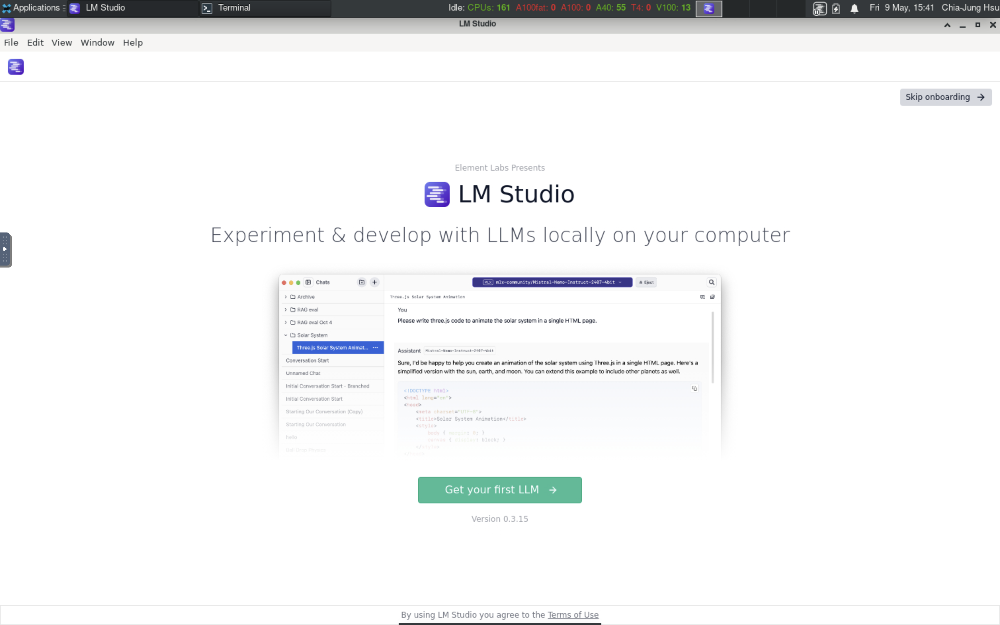
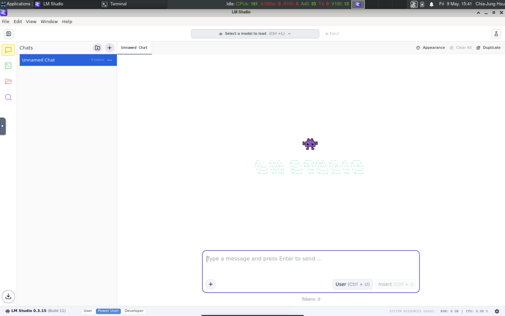
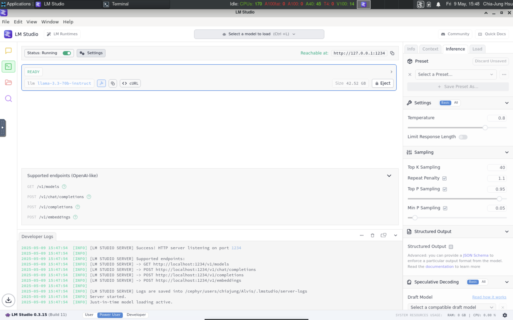

---
tags:
  - Inference
icon: fontawesome/solid/bolt
---

# Accessing LLMs

## Quick start

### LM Studio

[LM Studio](https://lmstudio.ai/) is a desktop app for developing and
experimenting with LLMs. It has a friendly user interface and suitable for
private usage. In this tutorial, we will use it to show some key concepts
in LLM inference.

We have deployed it on Alvis, you can find it in `Menu > C3SE > LM Studio`.

!!! important
    LM Studio supports limited file format and may not scale well on clusters.
    Don't use it for productive work.




#### Basic inference

Once you start LM studio, it brings you to a chat window. On top of the chat
window, you can see a drop-down list allowing you to select/download models.




Before downloading any models, it is important to select a directory to save
downloaded models. Click the folder icon in the sidebar, you can find that it
saves models into your home directory by default. You can change the path to
any directory where you have downloaded models. If you haven't downloaded any
model, you had better set the path to a directory under your storage project.
Otherwise, you run out of file/space quota easily.


Once you set the path, you can go back to the chat window to download/load
models and start a chat.


#### HTTP server

Besides of the chat window, LM Studio also supports OpenAI compatible server
to handl HTTP requests. The server can also be launched from the GUI by 
toggling the option in Developer tab in the sidebar. Once you start the server,
you can send HTTP requests to the listed endpoints. 


In the figure, it shows there are four endpoints:

- `/v1/models`
- `/v1/chat/completions`
- `/v1/completions`
- `/v1/embeddings`

You can test the API by sending HTTP request from your terminal by curl. For
example:

```console
# Request for available models
$ curl http://localhost:1234/v1/models
{
  "data": [
    {
      "id": "llama-3.3-70b-instruct",
      "object": "model",
      "owned_by": "organization_owner"
    },
    {
      "id": "text-embedding-nomic-embed-text-v1.5",
      "object": "model",
      "owned_by": "organization_owner"
    }
  ],
  "object": "list"
}
```

```console
# Chat
$ curl http://localhost:1234/v1/chat/completions -H "Content-Type: application/json" -d '{
    "model": "llama-3.3-70b-instruct",
    "messages": [
        { "role": "user", "content": "why is the sky blue" }
    ]
}'

{
  "id": "chatcmpl-stubx36wa8neg1u8jo5re",
  "object": "chat.completion",
  "created": 1746801158,
  "model": "llama-3.3-70b-instruct",
  "choices": [
    {
      "index": 0,
      "logprobs": null,
      "finish_reason": "stop",
      "message": {
        "role": "assistant",
        "content": "The sky appears blue because of a phenomenon called Rayleigh scattering, which is the scattering of light by small particles or molecules in the atmosphere.\n\nHere's what happens:\n\n1. **Sunlight enters Earth's atmosphere**: When sunlight enters our atmosphere, it contains all the colors of the visible spectrum (red, orange, yellow, green, blue, indigo, and violet).\n2. **Light encounters tiny molecules**: The light encounters tiny molecules of gases such as nitrogen (N2) and oxygen (O2) in the atmosphere.\n3. **Shorter wavelengths scatter more**: These small molecules scatter the shorter wavelengths of light, like blue and violet, more than the longer wavelengths, like red and orange. This is because the smaller molecules are more effective at scattering the higher-energy, shorter-wavelength light.\n4. **Blue light is scattered in all directions**: As a result of this scattering, the blue light is dispersed in all directions, reaching our eyes from all parts of the sky.\n5. **Our eyes perceive the sky as blue**: Since we see more blue light being scattered in all directions, our brains interpret the color of the sky as blue.\n\nThere are some additional factors that can affect the color of the sky:\n\n* **Dust and pollution**: Tiny particles in the atmosphere, like dust, smoke, or pollutants, can scatter light in different ways, making the sky appear more hazy or gray.\n* **Water vapor**: Water molecules in the air can also scatter light, which is why the sky often appears more blue on dry days.\n* **Time of day and sun position**: The color of the sky can change depending on the time of day and the position of the sun. During sunrise and sunset, the sky can take on hues of red, orange, and pink due to the scattering of light by atmospheric particles.\n\nIn summary, the sky appears blue because of the way that tiny molecules in the atmosphere scatter sunlight, favoring shorter wavelengths like blue and violet over longer wavelengths like red and orange."
      }
    }
  ],
  "usage": {
    "prompt_tokens": 40,
    "completion_tokens": 406,
    "total_tokens": 446
  },
  "stats": {},
  "system_fingerprint": "llama-3.3-70b-instruct"
}
```

More information can be found in the [official document](https://lmstudio.ai/docs/app/api/endpoints/openai)

#### Command line tools

Once you have ever stared LM studio, it automatically installs a command line
tool into you home directory: `~/.lmstudio/bin/lms`. With the tool, you can do
the same operations as what you can do in the GUI. You can also see the models
you have loaded from the GUI in the terminal

```console
$ ~/.lmstudio/bin/lms --help
lms <subcommand>

where <subcommand> can be one of:

- status - Prints the status of LM Studio
- server - Commands for managing the local server
- ls - List all downloaded models
- ps - List all loaded models
- get - Searching and downloading a model from online.
- load - Load a model
- unload - Unload a model
- create - Create a new project with scaffolding
- log - Log operations. Currently only supports streaming logs from LM Studio via `lms log stream`
- import - Import a model file into LM Studio
- flags - Set or get experiment flags
- bootstrap - Bootstrap the CLI
- version - Prints the version of the CLI

For more help, try running `lms <subcommand> --help`
```

```console
$ ~/.lmstudio/bin/lms status

   ┌ Status ───────────────────────────────────┐
   │                                           │
   │   Server:  ON  (Port: 1234)               │
   │                                           │
   │   Loaded Models                           │
   │     · llama-3.3-70b-instruct - 42.52 GB   │
   │                                           │
   └───────────────────────────────────────────┘
```

```console
$ ~/.lmstudio/bin/lms ps

   LOADED MODELS

Identifier: llama-3.3-70b-instruct
  • Type:  LLM
  • Path: lmstudio-community/Llama-3.3-70B-Instruct-GGUF/Llama-3.3-70B-Instruct-Q4_K_M.gguf
  • Size: 42.52 GB
  • Architecture: Llama
```

#### Advanced settings

In LM Studio GUI, you can find advanced setting in the Developer tab. You can
set the `temperature`, `top K`, `top P` values, etc in the inference setting.
There are also parameters about performance, like GPU offload, CPU Thread, KV
cache, etc.




### vLLM

- Offline inference
- HTTP server

### Others

- ollama + open webui


