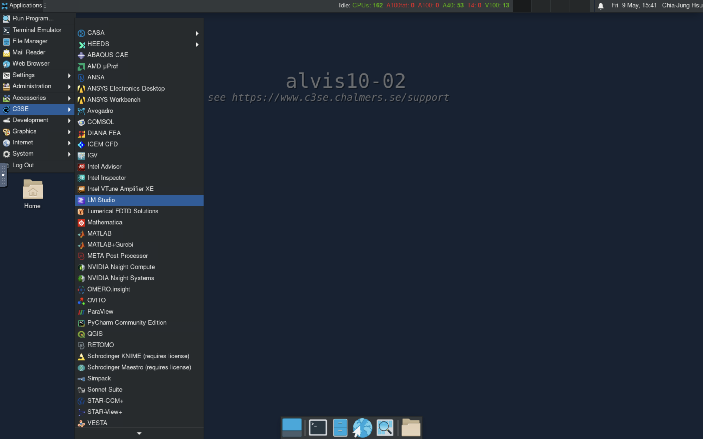
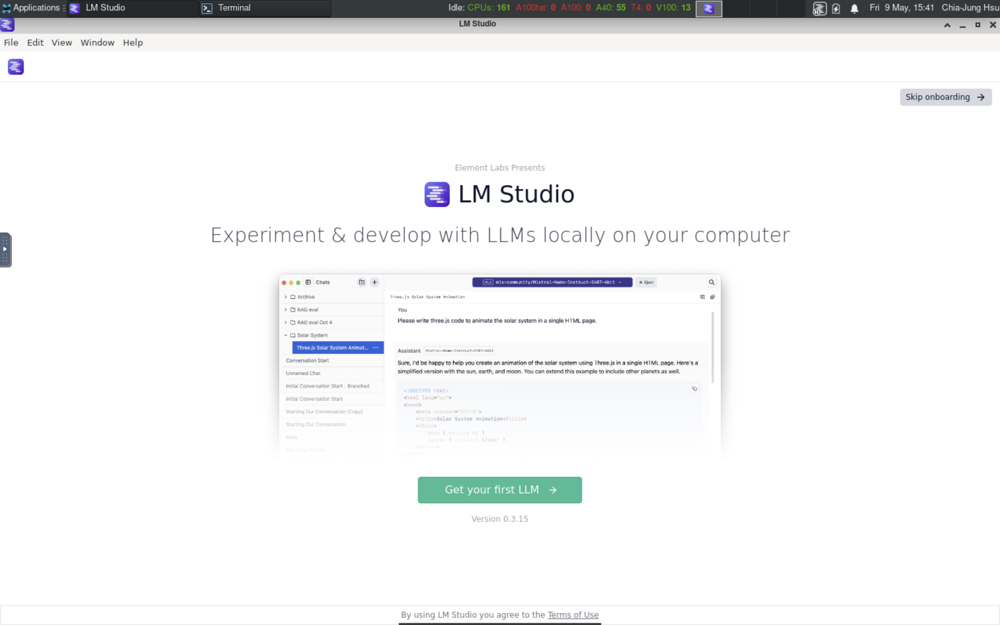
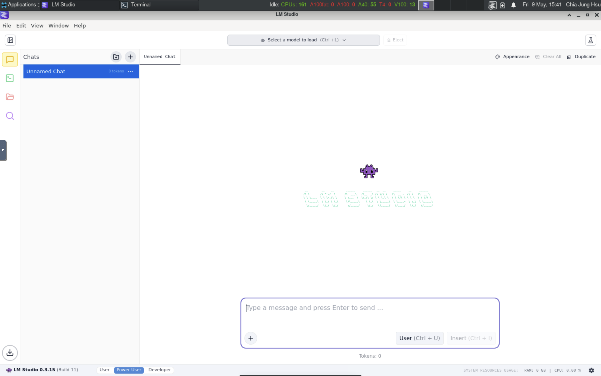
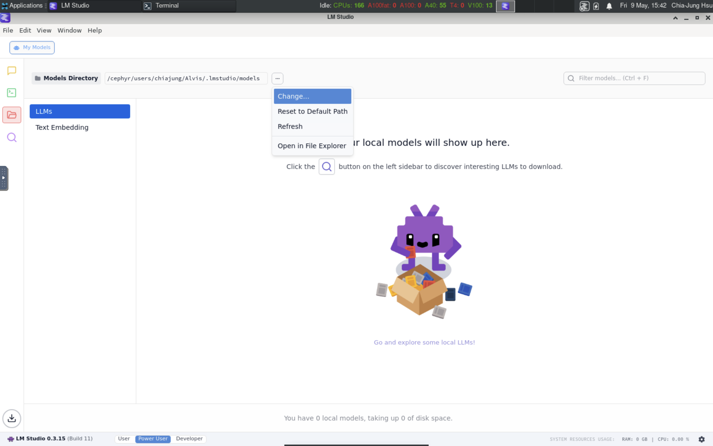
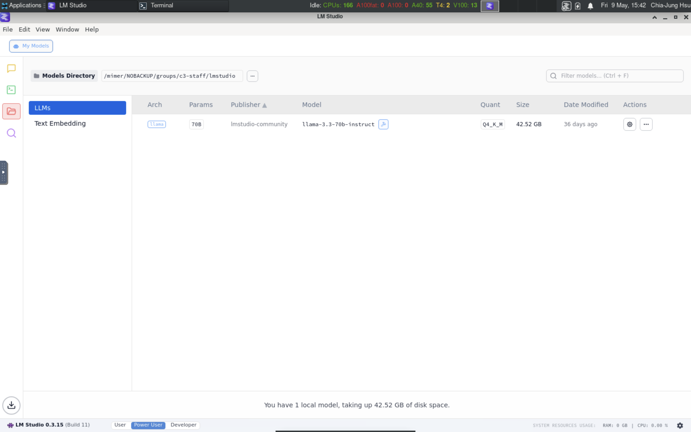
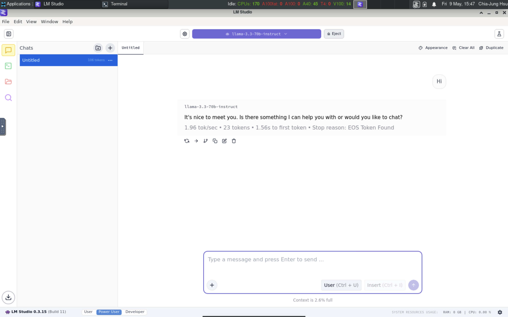
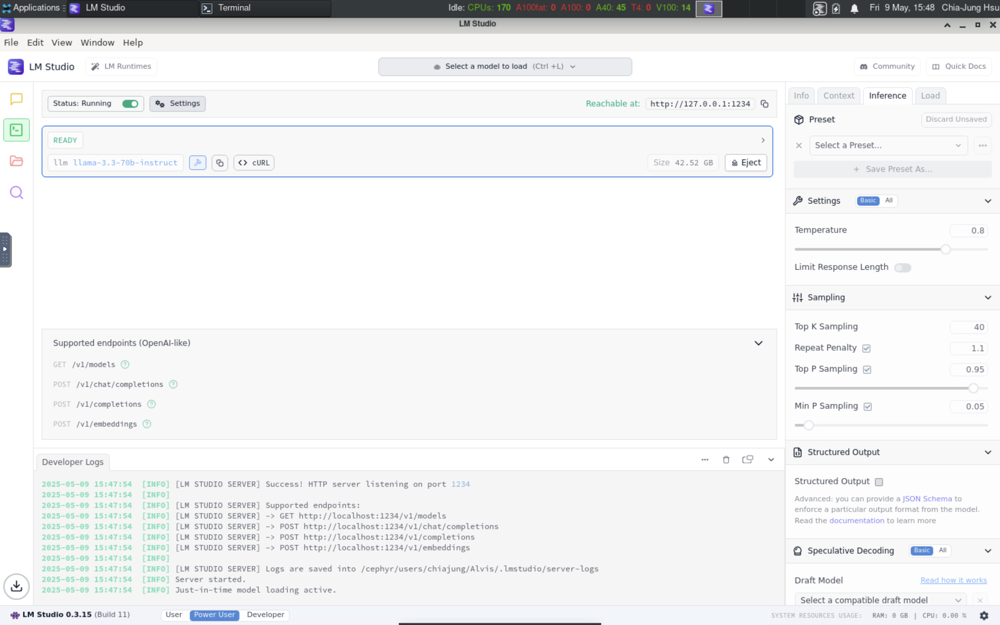

## [LM Studio](https://lmstudio.ai/)

### LM Studio on Alvis



<aside class="notes" markdown="1">

[LM Studio](https://lmstudio.ai/) is a desktop app for developing and
experimenting with LLMs. It has a friendly user interface and suitable for
private usage. In this tutorial, we will use it to show some key concepts
in LLM inference.

We have deployed it on Alvis, you can find it in `Menu > C3SE > LM Studio`.

!!! important
    LM Studio supports limited file format and may not scale well on clusters.
    Don't use it for productive work.

</aside>

### LM Studio desktop app



### Chat interface

<aside class="notes" markdown="1">
Once you start LM studio, it brings you to a chat window. On top of the chat
window, you can see a drop-down list allowing you to select/download models.
</aside>



### Model download


<aside class="notes" markdown="1">
Before downloading any models, it is important to select a directory to save
downloaded models. Click the folder icon in the sidebar, you can find that it
saves models into your home directory by default. You can change the path to
any directory where you have downloaded models. If you haven't downloaded any
model, you had better set the path to a directory under your storage project.
Otherwise, you run out of file/space quota easily.
</aside>

### Select download directory


### Check downloaded models


<aside class="notes" markdown="1">
Once you set the path, you can go back to the chat window to download/load
models and start a chat.
</aside>

### Load model and chat


### OpenAI-compatible API server

<aside class="notes" markdown="1">
Besides of the chat window, LM Studio also supports OpenAI compatible API
server to handle HTTP requests. The server can be launched from the GUI by 
toggling the option in Developer tab in the sidebar. Once you start the server,
you can send HTTP requests to the listed endpoints. 
</aside>


### Endpoints

- Four endpoints:
    - `/v1/models`
    - `/v1/chat/completions`
    - `/v1/completions`
    - `/v1/embeddings`

### Use OpenAI API

- Get available models: 
```console
$ curl http://localhost:1234/v1/models
```

<aside class="notes" markdown="1">

```json
{
  "data": [
    {
      "id": "llama-3.3-70b-instruct",
      "object": "model",
      "owned_by": "organization_owner"
    },
    {
      "id": "text-embedding-nomic-embed-text-v1.5",
      "object": "model",
      "owned_by": "organization_owner"
    }
  ],
  "object": "list"
}
```
</aside>

- Chat to a model:

```console
$ curl http://localhost:1234/v1/chat/completions -H "Content-Type: application/json" -d '{
    "model": "llama-3.3-70b-instruct",
    "messages": [
        { "role": "user", "content": "why is the sky blue" }
    ]
}'
```

<aside class="notes" markdown="1">
```json
{
  "id": "chatcmpl-stubx36wa8neg1u8jo5re",
  "object": "chat.completion",
  "created": 1746801158,
  "model": "llama-3.3-70b-instruct",
  "choices": [
    {
      "index": 0,
      "logprobs": null,
      "finish_reason": "stop",
      "message": {
        "role": "assistant",
        "content": "The sky appears blue because of a phenomenon called Rayleigh scattering..."
      }
    }
  ],
  "usage": {
    "prompt_tokens": 40,
    "completion_tokens": 406,
    "total_tokens": 446
  },
  "stats": {},
  "system_fingerprint": "llama-3.3-70b-instruct"
}
```
</aside>

- [More information](https://lmstudio.ai/docs/app/api/endpoints/openai)

### OpenAI Python SDK

```python
from openai import OpenAI

client = OpenAI(base_url="http://localhost:1234/v1")

model_list = client.models.list()
print(model_list)

response = client.chat.completions.create(
    messages=[{"role": "user", "content": "why is the sky blue?"}]
)
print(reponse)
```

### Command line tools

<aside class="notes" markdown="1">

Once you have ever stared LM studio, it automatically installs a command line
tool into you home directory: `~/.lmstudio/bin/lms`. With the tool, you can do
the same operations as what you can do in the GUI. You can also see the models
you have loaded from the GUI in the terminal

</aside>

```console
$ ~/.lmstudio/bin/lms status

   ┌ Status ───────────────────────────────────┐
   │                                           │
   │   Server:  ON  (Port: 1234)               │
   │                                           │
   │   Loaded Models                           │
   │     · llama-3.3-70b-instruct - 42.52 GB   │
   │                                           │
   └───────────────────────────────────────────┘
```

### Command line tools (continue)

```console
$ ~/.lmstudio/bin/lms ps

   LOADED MODELS

Identifier: llama-3.3-70b-instruct
  • Type:  LLM
  • Path: lmstudio-community/Llama-3.3-70B-Instruct-GGUF/Llama-3.3-70B-Instruct-Q4_K_M.gguf
  • Size: 42.52 GB
  • Architecture: Llama
```

Check more: `~/.lmstudio/bin/lms --help`

### Advanced settings

<aside class="notes" markdown="1">
In LM Studio GUI, you can find advanced setting in the Developer tab. You can
set the `temperature`, `top K`, `top P` values, etc in the inference setting.
There are also parameters about performance, like GPU offload, CPU Thread, KV
cache, etc.
</aside>



## [vLLM](https://github.com/vllm-project/vllm)

<aside class="notes" markdown="1">
> vLLM is a fast and easy-to-use library for LLM inference and serving.

vLLM itself doesn't have a GUI interface, but it is efficient for LLM inference
and allow users to load LLMs to multiple GPU and multiple nodes. It can scale
well on clusters like Alvis.

There are two main entrypoints in vLLM, OpenAI-Compatible API Server and LLM
class. The former one is implemented by the `AsyncLLMEngine` class while the
latter one is based on `LLMEngine` class.
</aside>

### OpenAI-Compatible API Server

- Launch server: `vllm serve unsloth/Llama-3.2-1B-Instruct`
    - default URL: `http://localhost:8000`
    - set host: `--host <host>`
    - set port: `--port <port>`
    - [More arguments](https://docs.vllm.ai/en/latest/configuration/engine_args.html)

Once a server is launched, in another terminal:

- Chat: `vllm chat`
- Completion: `vllm complete`
- Benchmark: `vllm bench`


### Endpoints

- Part of the endpoints
    - `/v1/models`
    - `/v1/responses`
    - `/v1/responses/{response_id}`
    - `/v1/chat/completions`
    - `/v1/completions`
    - ...
    - `/openapi.json`
    - `/docs`
    - `/health`
    - ...

- Similiarly, get available models: 
```
$ curl http://localhost:8000/v1/models
```

### Offline inference (LLM class)

- `LLM` python class

```python
from vllm import LLM

# Initialize the vLLM engine.
llm = LLM(model="unsloth/Llama-3.2-1B-Instruct")
```

- [Arguments](https://docs.vllm.ai/en/latest/api/vllm/index.html#vllm.LLM) are
  similar to the ones used in `vllm serve` except for some missing features
  like pipeline parallelism.


### LLM class methods

- Chat

```python
from vllm import LLM, SamplingParams

sampling_params = SamplingParams(
    temperature=0.6,
    max_tokens=128,
    top_p=0.9,
)

messages = [
    {"role": "user", "content": "Why is the sky blue?"},
]

llm = LLM(
    model="unsloth/Llama-3.2-1B-Instruct",
    tensor_parallel_size=4,
)

output = llm.chat(messages, sampling_params, use_tqdm=False)
print(output[0].outputs[0].text)
```

- [More examples](https://docs.vllm.ai/en/latest/models/generative_models.html).

## [Huggingface Transformers](https://huggingface.co/docs/transformers/main/index)

### OpenAI-Compatible API Server

- Launch server: `transformers serve` (model is not selected yet)
- Endpoints:
    - `/v1/chat/completions`
    - `/v1/responses`
    - `/v1/audio/transcriptions`
    - `/v1/models`
- Chat in another teminal: `transformers chat --model-name-or-path openai/gpt-oss-20b`
- [More information](https://huggingface.co/docs/transformers/main/serving)

### Lower level operation

```python
from transformers import AutoModelForCausalLM, AutoTokenizer

model_name = "openai/gpt-oss-20b"
tokenizer = AutoTokenizer.from_pretrained(model_name)
model = AutoModelForCausalLM.from_pretrained(
    model_name, torch_dtype="auto", device_map="auto"
)

messages = [
    {"role": "user", "content": "Explain what MXFP4 quantization is."},
]

inputs = tokenizer.apply_chat_template(
    messages, add_generation_prompt=True, return_tensors="pt", return_dict=True,
).to(model.device)

outputs = model.generate(
    **inputs, max_new_tokens=200, temperature=0.7
)

print(tokenizer.decode(outputs[0]))
```

## Other Tools

- [SGLang](https://docs.sglang.ai/)
- [Huggingface TGI](https://huggingface.co/docs/text-generation-inference/index)
- [Ollama](https://ollama.com/)

