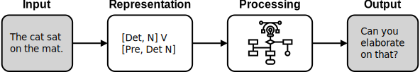
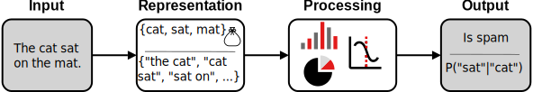
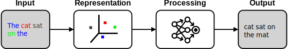
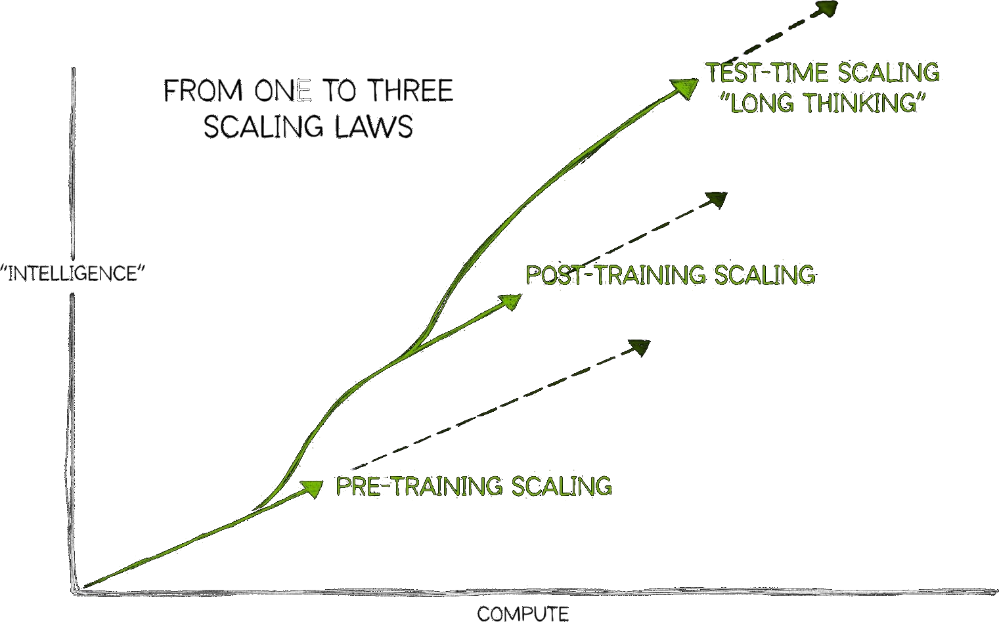

## Introduction
- History of AI
- Compute and AI
- Ethics and concerns
- Introducing the workshop hardware

## History of AI

- How has AI developed over time?

### AI as a term is coined
> We propose that **a 2-month, 10-man study of artificial intelligence** be carried out during the summer of 1956 at Dartmouth College in Hanover, New Hampshire. [...] An attempt will be made to find how to **make machines use language, form abstractions and concepts, solve kinds of problems now reserved for humans, and improve themselves**. We think that a significant advance can be made in one or more of these problems if a carefully selected group of scientists work on it together for a summer.

- [Darthmout Summer Research Project](http://jmc.stanford.edu/articles/dartmouth/dartmouth.pdf)(can be skipped)

### Early NLP &ndash; 1956-1966

- Rule based, lots of manual effort
- Lots of LISP
- Used for:
    - Information retrieval
    - Basic chat-bots e.g. [Eliza](https://en.wikipedia.org/wiki/ELIZA)
    - Limited translation systems

### AI Winter I &ndash; 1974-1980

- NLP Winter started even earlier

### Statistical NLP &ndash; 1980s

- Using statistics of the corpus
- Bag-of-words, N-grams

### AI Winter II &ndash; 1990s, early 2000s
- The word "AI" is **not** a buzzword
- Research continues under other names

### Deep Learning -- 2012-

- 2012: [AlexNet](https://doi.org/10.1145/3065386) has less than 25% error on ImageNet challenge
- 2018: Transformer architecture ([Attention Is All You Need](http://papers.nips.cc/paper/4824-imagenet-classification-with-deep-convolutional-neural-networks.pdf), [retrospectic](https://doi.org/10.1145/3065386))
- 2019: [GPT-2](https://cdn.openai.com/better-language-models/language_models_are_unsupervised_multitask_learners.pdf) released. Surprisingly good.
- 2020: [GPT-3](https://doi.org/10.48550/arXiv.2005.14165) released. Surprisingly still improving.
- 2022: ChatGPT (GPT-3.5) [released](https://openai.com/index/chatgpt/?utm_source=chatgpt.com). General public starts to take notice.

## Compute and AI
- What has changed? [The bitter lesson](https://en.wikipedia.org/wiki/Bitter_lesson)
<iframe src="https://ourworldindata.org/grapher/ai-performance-knowledge-tests-vs-training-computation?tab=chart" loading="lazy" style="width: 100%; height: 600px; border: 0px none;" allow="web-share; clipboard-write"></iframe>

### Compute use over time
<iframe src="https://ourworldindata.org/grapher/exponential-growth-of-computation-in-the-training-of-notable-ai-systems?tab=chart" loading="lazy" style="width: 100%; height: 600px; border: 0px none;" allow="web-share; clipboard-write"></iframe>
- [Compute](https://ourworldindata.org/scaling-up-ai#compute-scaling-up-computational-resources), but also [data](https://ourworldindata.org/scaling-up-ai#data-scaling-up-the-training-data), [architecture](https://ourworldindata.org/scaling-up-ai#data-scaling-up-the-training-data) and [algorithms](https://epoch.ai/blog/algorithmic-progress-in-language-models)

### What was new with ChatGPT?
- Base models are pure language models
- Chat models are:
    - Instruct tuned (supervised)
    - Reinforcement Learning with Human Feedback

### RLHF

- Enables RL when no clear scoring function available
- Much less human input than pure supervised learning

### Further scaling

## Ethics and issues
- Societal concerns
- Misuse concerns
- Misalignment concerns

### Societal concerns
- Perpetuated bias
- Confident falsehood and sycophancy
- Copyright & IP issues
- Distribution of wealth and the job market
    - <https://openai.com/index/gdpval/>
- Climate footprint
    - <https://www.nature.com/articles/s41598-024-54271-x>
    - <https://en.wikipedia.org/wiki/Jevons_paradox>

### Misuse concerns
- Mass spear phishing
- Cyberattacks
- Enabling bad actors
    - <https://www.nature.com/articles/s42256-022-00465-9>

### Misalignment
- RLHF is only a step in the right direction
    - <https://www.alignmentforum.org/posts/vwu4kegAEZTBtpT6p/thoughts-on-the-impact-of-rlhf-research?utm_campaign=post_share&utm_source=link>
- Goodhart's law
    - <https://doi.org/10.48550/arXiv.1803.04585>
- Misaligned leadership
    - Sam Altman, Elon Musk 
- Superintelligence
    - 

## Introduction to the hardware for this workshop
- Main reference: [Alvis introduction material](https://www.c3se.chalmers.se/documentation/first_time_users/intro-alvis/slides/)
- The Alvis system
- GPUs as compute accelerator
- Multi-GPU
- Containers
- Batch queue system

## Introduction Conclusion
- Briefly sketch what runs in background of chatbots on websites (or if using APIs) (bakom kulisserna)
- "This part is what we'll be learning today"

## Excercise
- Submitting a job TODO
