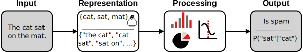
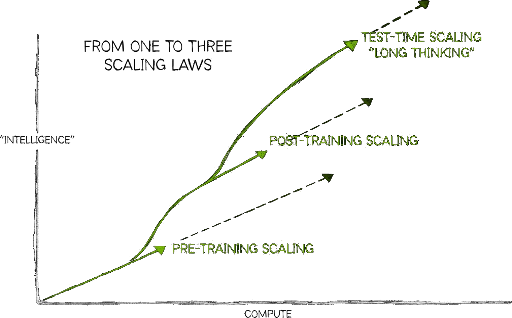
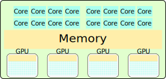
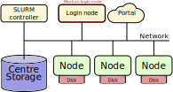
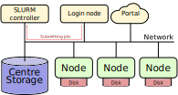

## Overview
<style type="text/css" rel="stylesheet">
.reveal section {
  text-align: center;
}
</style>
- History of AI
- Compute and AI
- Ethics and concerns
- Introducing the workshop hardware

## History of AI
<!-- Truncating the last four months because recent data is unreliable -->
<script type="text/javascript" src="https://ssl.gstatic.com/trends_nrtr/4271_RC01/embed_loader.js"></script>
<script type="text/javascript">
  var date_start = "2022-01-01";
  var d_end = new Date(); d_end.setMonth(d_end.getMonth() - 4)
  var date_end = d_end.toISOString().substring(0, 10)
  trends.embed.renderExploreWidget("TIMESERIES", {"comparisonItem":[{"keyword":"AI","geo":"","time":`${date_start} ${date_end}`}],"category":0,"property":""}, {"exploreQuery":"date=today%204-y&q=AI","guestPath":"https://trends.google.com:443/trends/embed/"});
</script>

- How has AI developed over time?

### AI as a term is coined
> We propose that **a 2-month, 10-man study of artificial intelligence** be carried out during the summer of 1956 at Dartmouth College in Hanover, New Hampshire. [...] An attempt will be made to find how to **make machines use language, form abstractions and concepts, solve kinds of problems now reserved for humans, and improve themselves**. We think that a significant advance can be made in one or more of these problems if a carefully selected group of scientists work on it together for a summer.

- [Darthmout Summer Research Project](http://jmc.stanford.edu/articles/dartmouth/dartmouth.pdf)

### Early NLP &ndash; 1956-1966


- Rule based, lots of manual effort
- Lots of LISP
- Used for:
    - Information retrieval
    - Basic chat-bots e.g. [Eliza](https://en.wikipedia.org/wiki/ELIZA)
    - Limited translation systems

### AI Winter I &ndash; 1974-1980

- NLP Winter started even earlier


### Statistical NLP &ndash; 1980s


- Using statistics of the corpus
- Bag-of-words, N-grams

### AI Winter II &ndash; 1990s, early 2000s
- The word "AI" is **not** a buzzword
- Research continues under other names

### Deep Learning &ndash; 2012-


- 2012: [AlexNet](https://doi.org/10.1145/3065386) has less than 25% error on ImageNet challenge
- 2017: Transformer architecture ([Attention Is All You Need](http://papers.nips.cc/paper/4824-imagenet-classification-with-deep-convolutional-neural-networks.pdf), [retrospectic](https://doi.org/10.1145/3065386))
- 2019: [GPT-2](https://cdn.openai.com/better-language-models/language_models_are_unsupervised_multitask_learners.pdf) released. Surprisingly good.
- 2020: [GPT-3](https://doi.org/10.48550/arXiv.2005.14165) released. Surprisingly still improving.
- 2022: ChatGPT (GPT-3.5) [released](https://openai.com/index/chatgpt/). General public starts to take notice.

### Deep Learning &ndash; Transformer architecture
<section style="text-align: left; margin-left: 5em">
No recurrent connections,  
thus more parallelizable.
</section>

<style>
img.transformer {
  float: right;
  max-height: 600px;
  width: auto;
  transform: translateY(-5em)
}
</style>
{.transformer}

### Deep Learning &ndash; Attention mechanism
- Scaled Dot-Product Attention
$$ \mathrm{Attention}(V, K, Q) = \mathrm{softmax}\left(\frac{QK^\top}{\sqrt{d_K}}\right)V $$
- Cross-attention: $Q = X_\mathrm{dec} W_Q$, $K = X_\mathrm{enc} W_K$ and $V = X_\mathrm{enc} W_V$
- Self-attention: Same $X$ used for all matrices
- In decoder, self-attention masks future tokens
- Autoregressive unimodal LLMs usually decoder only

## Compute and AI
- What has changed?
- [The bitter lesson by Richard Sutton, 2019](https://en.wikipedia.org/wiki/Bitter_lesson)

> The biggest lesson that can be read from 70 years of AI research is that general methods that leverage computation are ultimately the most effective, and by a large margin.

### Compute use over time
- [Compute](https://ourworldindata.org/scaling-up-ai#compute-scaling-up-computational-resources), but also [data](https://ourworldindata.org/scaling-up-ai#data-scaling-up-the-training-data), [architecture](https://ourworldindata.org/scaling-up-ai#data-scaling-up-the-training-data) and [algorithms](https://epoch.ai/blog/algorithmic-progress-in-language-models)

<iframe src="https://ourworldindata.org/grapher/exponential-growth-of-computation-in-the-training-of-notable-ai-systems?tab=chart" loading="lazy" style="width: 100%; height: 600px; border: 0px none;" allow="web-share; clipboard-write"></iframe>

### Compute and performance
<iframe src="https://ourworldindata.org/grapher/ai-performance-knowledge-tests-vs-training-computation?tab=chart" loading="lazy" style="width: 100%; height: 600px; border: 0px none;" allow="web-share; clipboard-write"></iframe>

### What was new with ChatGPT?
- Base models are pure language models
- Chat models are:
    - Instruct tuned (supervised)
    - Reinforcement Learning with Human Feedback

### RLHF
<style>
img.rlhf_diagram {
  max-width: 1232px;
  height: auto;
}
</style>
{.rlhf_diagram}

- Enables RL when no clear scoring function available
- Relatively little human input needed

### Further scaling
[](https://blogs.nvidia.com/blog/ai-scaling-laws/)

## Ethics and issues
- Societal concerns
- Misuse concerns
- Misalignment concerns

### Societal concerns
- Perpetuated bias
- Confident falsehood and sycophancy
- Copyright & IP issues
- Distribution of wealth and the job market
    - E.g. [GDPval](https://openai.com/index/gdpval/) benchmark
- Climate footprint
    - Word for word comparisson, [AI is cheaper](https://www.nature.com/articles/s41598-024-54271-x)
    - But, AI can generate a lot more text (rel. [Jevons paradox](https://en.wikipedia.org/wiki/Jevons_paradox)

### Misuse concerns
- Mass spear phishing, disinformation campaigns, ...
- Cyberattacks
    - [Finding](https://thehackernews.com/2024/11/googles-ai-tool-big-sleep-finds-zero.html) and exploiting vulnerabilities
- Enabling bad actors
    - [Dual use of artificial-intelligence-powered drug discovery](https://doi.org/10.1038/s42256-022-00465-9)

### Misalignment
<style>
img.thumbnail {
  max-height: 200px;
  width: auto;
  vertical-align: top;
  margin-left: 0.5em;
  transform: translateY(-0.5ch);
}
</style>

- RLHF is [only a step](https://www.alignmentforum.org/posts/vwu4kegAEZTBtpT6p/thoughts-on-the-impact-of-rlhf-research) in the right direction
- [Goodhart's law](https://doi.org/10.48550/arXiv.1803.04585)
- Misaligned leadership
    - What future are they aiming for?
- Superintelligence [{.thumbnail}](https://ifanyonebuildsit.com/)

## Introduction to the hardware for this workshop
- Main reference: [Alvis introduction material](https://www.c3se.chalmers.se/documentation/first_time_users/intro-alvis/slides/)
- Compute clusters
- GPUs as compute accelerator
- Multi-GPU
- Containers
- Batch queue system

### Compute clusters


### The compute node
<style>
img.generic_gpu_node {
  max-width: 60%;
  height: auto;
}
</style>
{.generic_gpu_node}

- Speed-up by parallelization
- Feeding data to GPU memory (VRAM) often bottleneck

### Software
- Default software environment intentionally sparse
- Use modules or containers to run software
- (Follow our [recommendations](https://www.c3se.chalmers.se/documentation/module_system/python/) when installing Python packages)
- We will use containers in this course

### Software &ndash; containers
- Apptainer containers
- A single file for your software and all dependencies
- ([Building containers](https://www.c3se.chalmers.se/documentation/miscellaneous/containers/#building-containers))
- Running software in a container
```bash
apptainer exec your_container.sif python your_code.py
```

### SLURM
- Batch queueing system
- Allocates resources in a fair and effective manner
- Resources are finite so expect queue times occasionally

### SLURM workflow &ndash; Preparing job


### SLURM workflow &ndash; Submitting job to queue


### SLURM workflow &ndash; Job starts


### Partial command overview
- View queued and running jobs `squeue [--me]`
- View previous jobs `sacct`
- Submit jobs `sbatch <JOBSCRIPT>`
- Cancel queued or running jobs `scancel <JOBID>`
- More complete overview at [SLURM documentation](https://slurm.schedmd.com/quickstart.html#commands) and [Alvis intro](https://www.c3se.chalmers.se/documentation/first_time_users/intro-alvis/slides/#job-command-overview)

## Summary of Introduction
- Compute a key component to the success of LLMs
- Use and development of AI is not without its issues
- The hardware you can access
- Containers for accessing software
- SLURM batch queue system for running things on the cluster

## Excercise
1. Make sure you have finished [prerequisites](../prerequisites.md)
2. Navigate to the workshop project storage directory
3. Create your own directory e.g. `mkdir ${USER}`
4. Copy `/mimer/NOBACKUP/groups/llm-workshop/exercises/day1/introduction/` and its content to your directory
5. Do the below excercises

### Submitting a batch job
1. Take a look at `jobscript.sh` with your favourite editor
2. Submit `jobscript.sh` with sbatch
3. Monitor your jobs (with `job_stats.py <JOBID>` and/or manually over SSH)
    - Use `squeue` and `sacct` to see job-IDs, nodelist etc.
    - Job stats links are at the top of `slurm-<JOBID>.out`

### Running interactively
1. Go to <https://alvis.c3se.chalmers.se>
2. Launch a short interactive session using few resources
3. Try it out and make sure to close the session when you are done
4. (Optional) adapt a runtime from `/apps/portal/` to your own runtime in `~/portal`
