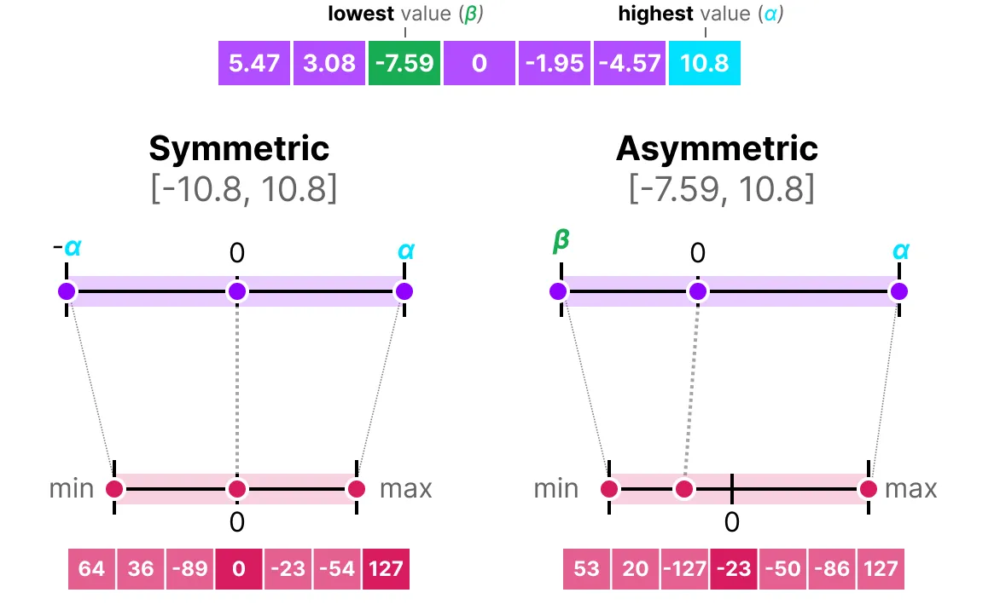

<aside class="notes" markdown="1">

This section is available as slides which is presented on the workshop. This
text version include some additional notes. You can also access the slide
version [here](./llm_formats-slides).

</aside>

## Overview

<aside class="notes" markdown="1">

This section cover the following:

</aside>

- Formats of LLM models
- Formats of numbers
- Quantization of LLM
- Quantization and performance

## Formats of LLM models

### So you want to use a LLM model

{ style="height=360px" }

<aside class="notes" markdown="1">

It is common for LLMs to be quantized after training. The quantization of
LLMs is relevant to the model's compatibility with different implementations, as
well its its performance, both in terms of accuracy and speed. This section will
focus on explaining details of different floating point number formats and
quantization methods.

</aside>

### What the name means

- `Llama-3.3`: model (architecture)
- `70B`: size / number of parameters
- `Instruct`: fine-tuning
- `AWQ-INT4`: quantization
- `GGUF`: model format

<aside class="notes" markdown="1">

Models architecture and size are often the first consideration when working on
LLM.  But equally important are the format of models and the quantization
method. Modern acceleration devices cater for the lower precision need of
machine learning models, depending on the device you want to run on, quantized
models might give significant speed up.

</aside>

### File-formats of LLMs

{ style="max-height:360px" }

The gguf file fomat (image from [huggingface](https://huggingface.co/docs/hub/gguf))

<aside class="notes" markdown="1">

LLM models commonly consists of metadata, and the tensor themselves.

</asisde>

### Common formats of LLMs

- bin/pth/tf: "raw" ML library formats;
- safetensors: used by huggingfacs;
- ggml/gguf: developed by llama.cpp (supports many qunatization formats);
- llamafile: by mozilla, single-file format, executable.

You can find detailed model information for some model formats,
[example](https://huggingface.co/QuantStack/Qwen-Image-Edit-2509-GGUF?show_file_info=Qwen-Image-Edit-2509-Q2_K.gguf).

<aside class="notes" markdown="1">

Models are published on different formats and they are optimized for different
usages. They can be converted to one another but has different purposes.

raw formats used by ML formats might be handy for re-training. Some of them
contain pickled data so might execute arbitrary code (unsafe).

Newer formats like GGUF/safetensors are suitable for common model architectures
(different engines will support them if the architecture is known). They are
memory-mapped, which are especially useful for [disk offloading].

[disk offloading]: https://huggingface.co/docs/accelerate/package_reference/big_modeling#accelerate.disk_offload

</aside>

### Look for the following

- Quantization method;
- Number format;
- Hardware compatibility hints.

## Formats of numbers

### Why do we care?

- Quantization allow you to run larger models;
- It might also eliminate expensive communication;
- ML tolerates lower numerical precision;
- Number formats also determines "distributioin of information";

### Number formats

### Floating point formats - cont. 1

### Floating point formats - cont. 2

### Hardware Compatibility

|                             | hardware accel. | note        |
|-----------------------------|-----------------|-------------|
| fp16/32/64                  | most gpus       | IEEE 754    |
| fp8 [(E4M3/E5M2)][onnx-fp8] | hooper          | Recent IEEE |
| bf16                        | most gpus       | Google's    |
| tf32                        | nvidia-gpus     | Nvidia      |
| int4/8                      | most GPUs       |             |

[onnx-fp8]: https://onnx.ai/onnx/technical/float8.html

See also [Data types support][amd-fp-formats] by AMD RocM.

[amd-fp-formats]: https://rocm.docs.amd.com/en/latest/reference/precision-support.html

<aside class="notes" markdown="1">

Floating point number generally follows a IEEE standard format. However, details
like the representation of negative zeros (NZ) and infinite values might be
different.

</aside>

### Rule of thumb

- ML tasks favor a larger proportion of exponents;
- [Google's bf16] (same range as fp32, less mantissa);
- training usually done in fp32/16;
- int4/8 is good for inference (on older GPUs).

[Google's bf16]: https://cloud.google.com/blog/products/ai-machine-learning/bfloat16-the-secret-to-high-performance-on-cloud-tpus

## Quantization methods

### Quantization target

- Weight/activation/mixed percision (w8a16);
- KV-cache;
- Non-uniform;

<aside class="notes" markdown="1">

weights is usually the first thing to quantize, it is also the most supported
way of quantizing the model. Depending on the hardware, it might or might not
support converting the tensors between precision or doing tensor operations
natively.

For instance, FP8 is not officially support on Ampere GPUs (A40 and A100). While
there exist implementations that makes [w8a16][vllm-fp8] operations available,
quantizating KV cache to FP8 currently [need hardware
support](https://discuss.vllm.ai/t/kv-cache-quantizing/749).

[vllm-fp8]: https://docs.vllm.ai/en/v0.5.2/quantization/fp8.html

Models can also been quantized
[non-uniformly](https://docs.vllm.ai/projects/llm-compressor/en/latest/examples/quantization_non_uniform/)

</aside>

### (A)symmetric qunatization

- linear transformation;
- depend on original range;
- position of zero.

<aside class="notes" markdown="1">

One important aspect when quantizing the models is the distribution of the
model, the easiest way is to simply scale the parameters by a factor.

To minimize loss of precision, we could map the parameters according to the
max/min values of the parameter, rather than the number-format range. There, we
need to choose whether we shift the zero point in the transform (but introduces
complexity in computation).

</aside>

### Clipping

<aside class="notes" markdown="1">

we can also choose to clip out the outlier to same more precision.

</aside>

### Calibration for weight quantization

<aside class="notes" markdown="1">

For parameters of the model We can simply quantize them, since we know their
distribution. But given some small dataset but we can also improved the accuracy
but estimating how important each parameter it. A popular way to do that is the
GPTQ method.

</aside>

Illustration of GPTQ method, where quantization are done to minimize the error,
weighed by according to the inverse Hessian (sensitivity).

### Calibration for activation qunatization

Can be dynamic or static.

<aside class="notes" markdown="1">

To also quantize the activation function, we need to estimate the range of
activation, that has to be done by passing data to the model and collect
minima/maximi. We can do that either dynamically (during inference) or
statically (with a calibration set).

</aside>

### Post-training quantization methods (PTQ)

- Weights and/or activation;
- Calibration/accuracy trade off;
- Not detailed here: sparsification.

<aside class="notes" markdown="1">

Models may also be sparsified to reduce the required computation, this is
commonly known as weight pruning. But some GPUs also support efficient
evaluation of sparse matrices if the sparsity follow certain pattern (example
with [llm-compressor]);

[llm-compressor]: https://github.com/vllm-project/llm-compressor/blob/main/examples/sparse_2of4_quantization_fp8/README.md

So far we covered mostly the so-called PTQ method when we do/can not run the
training (for a complete list with compatibility see [vLLM guide]).

[vLLM guide]: https://github.com/vllm-project/llm-compressor/blob/main/docs/guides/compression_schemes.md

</aside>

### Quantization aware training (QAT)

QAT introduce quantization error during training;

{ style="max-height:100px;" }
{ style="max-height:300px;" }

<aside class="notes" markdown="1">

But we can also get higher accuracy by using the Quantization aware training
(QAT) method. There we do the training and perform the
quantization/dequantization; which this the first thing we gain is that we can
actually optimize the quantization parameters as part of the training process.

</aside>

### Quantization aware training (QAT) - cont.

<aside class="notes" markdown="1">

The reason why it might work better, is that by introducing the quantization
error in the training process, we force the model to land in a local minima
where it is less sensitive to model parameters. So even the original model
performs worth, the quantized model works better

</aside>

## Summary

### When choosing a model

+ Know the hardware/implementation compatibility;
+ Find the right model/format/qunatization;
+ Quantize if needed;
+ Look up/run benchmarks.

### Other useful links

Benchmarks:

- [derek135/quantization-benchmarks](https://huggingface.co/datasets/derekl35/quantization-benchmarks)
