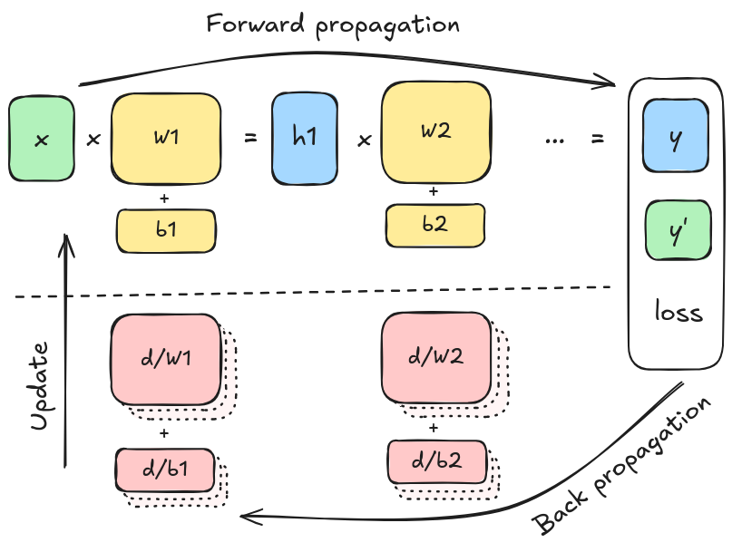
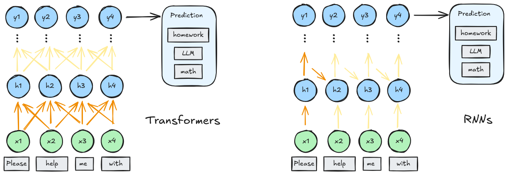
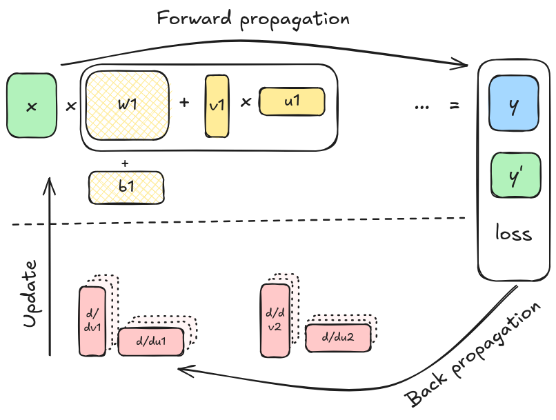
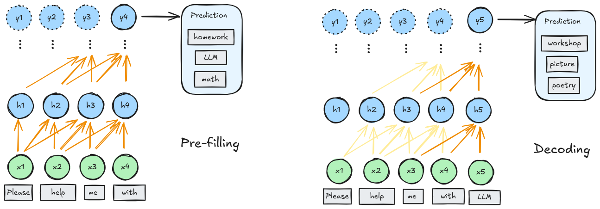
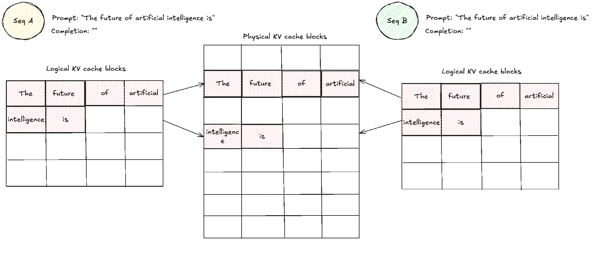
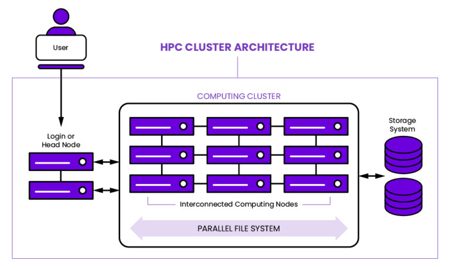
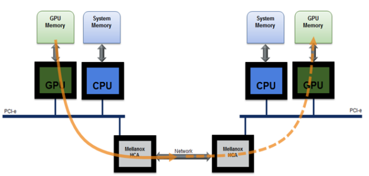

<section data-visibility="hidden" markdown=1>

This section is available as slides which is presented on the workshop. This
text version include some additional notes. You can also access the slide
version [here](../llm_hardware-slides).

</section>

### Overview

<aside class="notes" markdown="1">

This session covers the following:

</aside>

- Computations in LLMs
- LLM on super-computers

## Computations in LLMs

### Neural networks

<aside class="notes" markdown="1">

Neural networks are building blocks of modern machine learning applications, a
basic illustration of neural network is shown below:

</aside>

{ style="height:360px"}

<aside class="notes" markdown="1">

In a nutshells a neural network is a function constructed from a chain of
matrix multiplications (followed by activation functions). The "weights" and
"biases" are parameters of the models, and they can be trained with the gradient
descent algorithm, i.e.:

- compute the output of your model;
- compute the *loss function* according to reference output
- compute the gradient of loss with respect to your parameters;
- update you parameters slightly in the direction that reduces the loss the most;

Neural networks are however:

- **easy to differentiate:** thanks to automatic differentiation;
- **easy to parallelize:** matrix multiplications can be done in parallel;
- **easy to scale:** training is done on small subsets of data per step.

which makes it extermely easy to scale up, and show great performance when
scaled up. [^1]

Note that during training, we need to store multiple copies of all model
parameters (for gradients, optimizer states, etc.), which multiplies memory
needs. This is one major challenge we face for training LLMs.

[^1]: If you are surprised that models work better with more variables, you are
not alone; see [double descent](https://en.wikipedia.org/wiki/Double_descent).

</aside>

- Learn patterns by adjusting parameters (weights);
- Training = prediction → differentiation → update;
- So far: mini-batch & optimizer & big → good.

### Attention mechanism

<aside class="notes" markdown="1">

The "secret sauce" of transformer models is the so-called attention mechanism.
Generally speaking attention mechanism is how one compute pairwise
(similarities), and do so by creating the "keys" and "queries" using neural
networks.

Think of it as a general way to building a function that models the relation
between two things (or two sets of inputs), where relation is parameterized by a
neural network. The attention mechanism can be self-attention (the case for
language models) or not (e.g. when one have keys/values from a picture and
queries by a word).

</aside>

{ style="height:360px" }  
Image source: [Introduction to Attention Mechanism](https://erdem.pl/2021/05/introduction-to-attention-mechanism)

- keys, queries, and vales (K,Q,V);
- general ways of building trainable "relations" from neural networks;
- self-attention.

### Transformer vs. RNN

<aside class="notes" markdown="1">

Transformers is an innovation that makes a training a large language model
practical. Unlike RNNs or LSTMs, they do not rely on a hidden state that is
carried sequentially.

</aside>

{ style="height:360px" }

- Transformer computes *relationships* between tokens (attention);
- tokens can be processed in parallel

<aside class="notes" markdown="1">

Instead, the transformer computes *relationships* between all tokens in a
sequence using the self-attention mechanism.  This means that during training,
all tokens can be processed in parallel. **Caching** of the relations between
tokens will be crucial to **inference** performance, but during **training**,
we can see transformer as just a composition of neural network blocks that
predicts the next token with a sequence of previous ones.

</aside>

### Training of LLMs

{ style="height:350px;" }

- Just neural networkes that can be parallelized more efficiently;

<aside class="notes">
Training of LLMs are not very different from other large neural network
models. Just as a recap, you need to run the run the model to predict 
your predicate, compute a loss function, use back-propagation to compute
the gradient of the loss function, and save some states for each parameter
to update the parameters.
</aside>

### Fine-tuninig of LLMs

{ style="height:360px" }

- With specialized data (instruct, chat, etc);
- Less memory usage by "freezing parameters";
- LoRA: low-rank adapters (arXiv:2106.09685).

<aside class="notes" markdown="1">

Once a base model is trained, we usually fine-tune it on specific data
(instruct, chat, etc.). From a computation point of view, fine-tuning is almost
the same task as training, but you we can use some tricks to reduce the resource
we need.

Above is a diagram of the LoRA (Low-Rank Adaptation) algorithm.[^lora] Instead of
updating a full weight matrix, we consider updating it by a matrix product of
two small ones, this way we still need to do one copy of the big matrix, but the
backward path we just have the two low-rank matrices.

[^lora]: arXiv:2106.09685 [cs.CL]

</aside>

### Inference of LLMs

<aside class="notes" markdown="1">

Inference will need much less memory than training as we only need the forward
pass. But this is actually an interesting aspect of LLMs as compared to other
common machine learning tasks.

Inference of LLM involves two distinct parts:

</aside>

{ style="height:360px" }

- GPT-style inference: *pre-filling* and *decoding*;
- Pre-filling: process the input prompt in parallel;
- Decoding: generate new tokens one-by-one, using cached results.

<aside class="notes" markdown="1">

- **pre-filling**: process the entire prompt, this can be done in parallel
   efficiently;
- **decoding**: generate one token at a time, but the intermediate results
   from previous can be cached as **key–value (KV) cache**, saving computation
   at the expense of memory.

Think about what your inference task in mind, will it be more heavy in
pre-filling or decoding?

</aside>

### Optimize caches for inference

<aside class="notes" markdown="1">

Many effort in improving inference of LLMs has been put on improving efficiency
of memory accessing patterns and reducing the memory needed. As an example, the
paged attention mechanism groups adjacent tokens into virtual memory "pages"
like has been done in operating system kernels.

</aside>

{ style="height:360px" }

- Optimizing access to KV cache:
  + paged attention: indexed blocks of caches;
  + flash attention: fuse operations to reduce caches;

<aside class="notes" markdown="1">

This allows us to efficiently use the fast memory on the GPUs.  You can find
more in-depth discussion of the technique from this [blog
post](https://hamzaelshafie.bearblog.dev/paged-attention-from-first-principles-a-view-inside-vllm/)
(source of this visualization).

[paged attention from first principles]: https://hamzaelshafie.bearblog.dev/paged-attention-from-first-principles-a-view-inside-vllm/

</aside>

### Key takeaways

- LLMs/NNs benefit from massive parallelization;
- Different need for different tasks:
    + training: memory + compute + data throughput;
    + fine-tuninig: similar to training, cheaper;
    + pre-filling: compute;
    + decoding: memory;

## LLM on HPC clusters

### LLM on general computers

<aside class="notes" markdown="1">

Personal computers typically do not have sufficient resource (GPUs with large
memory). While it is possible to run LLM for inference, it typically requires
techniques to reduce the need for GPU memory, or use CPUs only:

</aside>

- Memory-mapped file formats;
- Quantization;
- CPU offloading;

<aside class="notes" markdown="1">

We will not go into details about them in this workshop.

</aside>

### HPC clusters

{ style="height:360px" }

<aside class="notes" markdown="1">

HPC are designed for parallel computing; the hardware is equipped with:

</aside>

- Racked computer nodes;
- Parallel network storage;
- Infiniband/RoCE networking;

<aside class="notes" markdown="1">

Which allow them to handle:

- fast communication between node;
- fast access to storage (local or shared);
- many CPUs/GPUs in one node

</aside>

### Alvis hardware - compute

<aside class="notes" markdown="1">

Specifically, Alvis is a HPC cluster built for AI research, so it's equipped
with latest (at the time) GPU acceleration cards. They are capable of doing fast
floating point operations in reduced precision (we will detail the implication
of those number formats in the next section).

</aside>

| Data type | A100        | A40   | V100 | T4   |
|----------:|-------------|-------|------|------|
|      FP64 | 9.7 \| 19.5 | 0.58  | 7.8  | 0.25 |
|      FP32 | 19.5        | 37.4  | 15.7 | 8.1  |
|      TF32 | 156         | 74.8  | N/A  | N/A  |
|      FP16 | 312         | 149.7 | 125  | 65   |
|      BF16 | 312         | 149.7 | N/A  | N/A  |
|      Int8 | 624         | 299.3 | 64   | 130  |
|      Int4 | 1248        | 598.7 | N/A  | 260  |

### Alvis hardware - network & storage

<aside class="notes" markdown="1">

Alvis is also equipped with fast storage system backed by flash storage; on the
most powerful nodes (4xA100 GPUs) infiniband network that goes directly to
storage is available.

They were designed to facilitate fast loading of data, which is useful for any
training tasks. In the case of LLM, one should already benefit from that for
training.

It is worth noting that the while one typically do not need such fast storage
for inference, the LLM inference can actually take advantage of fast storage
backend, this is rather experimental, but take a look at the [LMcache] package
if you want to optimize you inference tasks for real.

[LMcache]: https://docs.lmcache.ai/kv_cache/storage_backends/infinistore.html

</aside>

{ style="height:200px" }

- Infiniband: 100Gbit (A100 nodes);
- Ethernet: 25Gbit (most other nodes);
- Fast storage: [WEKA file system].

[WEKA file system]: https://docs.weka.io/weka-system-overview/about/weka-system-functionality-features

### Running LLMs on supercomputers

<aside class="notes" markdown="1">

Supercomputers allow us to run larger LLMs because of not only the more powerful
nodes, but also the nodes are connected with fast internet connection. We still
have the same issue as most high performance computing tasks, the CPUs need to
access the memory and the data need to transferred.

Most commonly, when you try to run a large model (70B and 400B) parameters, you
need to split the models to many GPUs. You can choose to quantize the model, so
that the model use less memory, and you need less GPUs and less overhead from
parallelization. To this end, you will need to look up the compatibility between
the model, hardware and implementation.

You will also need to think about how do you parallelize the models, you have
the options:

- Tensor parallelism;
- Pipeline parallelism;
- Data parallelism

In the next session we will introduce the different formats in LLMs, and
tomorrow's sessions will cover details about the parallelism schemes.

</aside>

- Most common bottleneck: **memory**
- Quantized models to fit larger models;
- Parallelize the model across GPUs or nodes;

### Tools to gather information

{ style="height:360px" }

<aside class="notes" markdown="1">

When using LLM on HPC, one should keep an eye on the resource utilization and
make sure that the resource is used efficiently. It is also helpful to glean
metrics about the jobs to identify the bottleneck of the computation and
optimize the performance tools are available on alvis and can be used to gather
such information:

</aside>

- grafana (network utilization, temp disk);
- nvtop, htop (CPU/GPU utilization, power draw);
- nvidia nsight (advanced debugging and tracing);

Find details in [C3SE documentation](https://www.c3se.chalmers.se/documentation/submitting_jobs/monitoring/).

## Summary

### Take home messages

- LLMs/neural networks benefit from massive parallelization;
- Same issue of memeory vs. compute-bound;
- Some optimization strategies;
- Be aware of the troubleshooting tools!

### Useful links

- The nanotron team has some in-depth discussion about the efficiency of model
  training; ([The Ultra-Scale Playbook]), as well as a [prediction memory]
  estimation tool;
- Alvis [hardware specifications];
- Alvis [monitoring tools];

[The Ultra-Scale Playbook]: https://huggingface.co/spaces/nanotron/ultrascale-playbook
[prediction memory]: https://huggingface.co/spaces/nanotron/predict_memory
[hardware specifications]: https://www.c3se.chalmers.se/about/Alvis/#gpu-hardware-details
[monitoring tools]: https://www.c3se.chalmers.se/documentation/submitting_jobs/monitoring/

