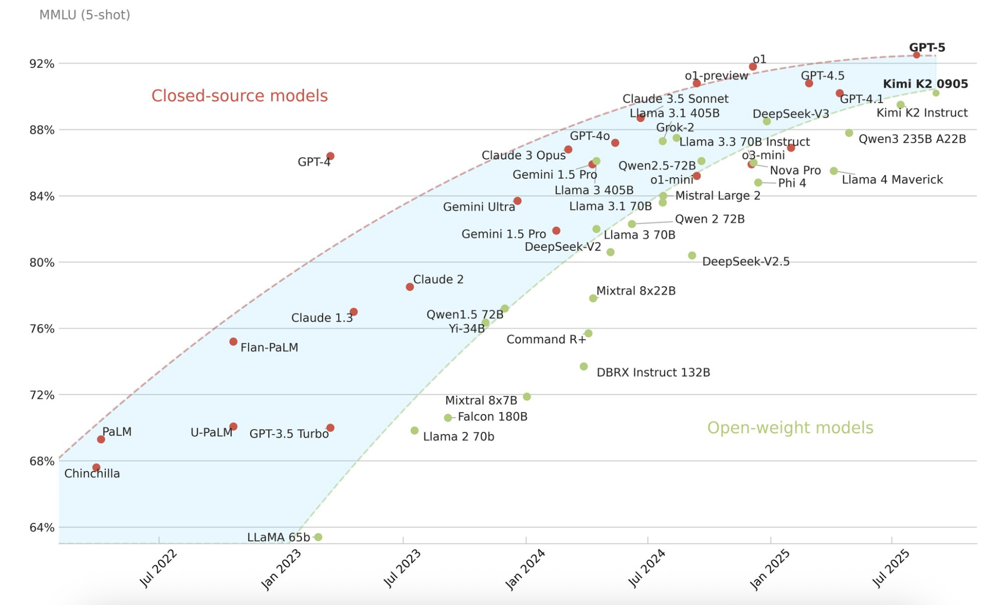

---
tags:
  - Public llm
  - Introduction
---

# Brief introduction to publicly available LLMs

???- info "Learning outcomes"

    - To understand the different categories that LLM comes in
    - To know which matrices to look at for your particular usecase

## Arena

<figure markdown="span">
  { width="700" }
  <figcaption>Narrowing performance gap on MMLU benchmark (Apr 2022 - Aug 2024) with human domain experts at 89.8%</figcaption>
</figure>

Open-weight models are catching up with closed source models steadily[^1]. However, creating high-quality benchmarks is an active area of research as the existing ones are beginning to plateau. 

## Categories 

* LLMs come in wide-range of "openness".
* Public != Open.
* “Publicly Available” means that the model checkpoints can be publicly accessible (terms can still apply) while “Closed Source” means the opposite.

| Category (ordered by openness) | Weights available? | Inference | Fine‑tuning | Redistribute weights / derivatives | Typical license | Examples |
|--------------------------------|--------------------|-----------|------------|------------------------------------|-----------------|----------|
| **Open Source (OSI‑compatible)** | ✅ Full | ✅ | ✅ | ✅ | Apache‑2.0 / MIT | Mistral 7B ; OLMo 2 ; Alpaca |
| **Open Weights (restricted / gated)** | ✅ Full | ✅ | ⚠️ License‑bound (e.g., research‑only / carve‑outs) | ❌ Usually not allowed | Custom terms (Llama / Gemma / RAIL) | Llama 3 (Meta Llama 3 Community License); Gemma 2 (Gemma Terms of Use); BLOOM (OpenRAIL) |
| **Adapter‑only / Delta releases** | ⚠️ Partial (adapters/deltas) | ✅ (after applying) | ✅ (adapters) | ✅ Adapters (base license applies) | Mixed | LoRA adapters over a base model |
| **Proprietary API + FT** | ❌ | ⚠️ API-only | ⚠️ API‑only (no weights export) | ❌ | Vendor ToS | OpenAI (GPT‑4.1, o4‑mini FT/RFT); Cohere (Command R/R+ FT); Anthropic (Claude 3 Haiku FT via Bedrock) |
| **Proprietary API‑only** | ❌ | ⚠️ API-only | ❌ | ❌ | Vendor ToS | Google Gemini API|

## Leaderboard
[Open LLM Leaderboard](https://huggingface.co/spaces/open-llm-leaderboard/open_llm_leaderboard#/)

## Which model to use?

Focus on a small set of comparable metrics (most appear on the Open LLM Leaderboard or model cards):

Core capability benchmarks (higher is better unless noted)

- MMLU-Pro[^2]: general academic/world knowledge 
- GSM8K: grade‑school math reasoning
- BBH / ARC / HellaSwag / Winogrande: reasoning & commonsense
- HumanEval / MBPP: code synthesis
- TruthfulQA: resistance to misinformation (higher = more truthful)
- MT-Bench / Instruction-following composite: dialogue quality

Model + deployment fit

- License: can you use it commercially? (e.g., Apache 2.0 vs research-only)
- Parameter count & architecture: affects quality vs hardware cost
- Context length: needed for long documents / RAG
- Multilingual support: required? (check benchmark variants or model card)

Efficiency

- Inference latency (tokens/sec on target hardware)
- VRAM / RAM footprint at desired precision (BF16, FP16, 4/8-bit)
- Quantization availability (Q4_K_M, Q6, GPTQ, AWQ)
- Throughput scalability (batching support)

Adaptability

- Fine-tuning options: LoRA, QLoRA, full, adapters
- Available instruct / chat variant (saves tuning effort)
- Tool / function calling support (if integrating with agents)
- Safety / alignment layer (helpful for end-user exposure)

Reliability & safety

- Evaluation variance (multiple seeds?)
- Known failure modes (hallucination, formatting drift)
- Safety / toxicity / jailbreak notes (model card & community reports)

Selection heuristic (fast path)

1. Filter by license + context length + hardware limits.
2. Compare MMLU + GSM8K (general + reasoning) for baseline quality.
3. Add domain benchmark (e.g., HumanEval for code) if relevant.
4. Pick smallest model meeting quality threshold; only move up in size if a key benchmark is lacking.
5. Prototype with quantized variant; move to higher precision only if quality degrades.

Rule of thumb

- Lightweight tasks (classification, simple RAG): 7–13B well-aligned model.
- Reasoning / coding: strongest 14–34B or distilled frontier-tier open model.
- Long-context analysis: prioritize extended context (e.g., 128K) over marginally higher MMLU.

Document your chosen metrics + hardware profile for reproducibility.

[^1]: The path forward for large language models in medicine is open. [Nature](https://www.nature.com/articles/s41746-024-01344-w)
[^2]: MMLU-Pro: A More Robust and Challenging Multi-Task Language Understanding Benchmark. [Arxiv](https://arxiv.org/pdf/2406.01574)