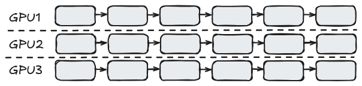
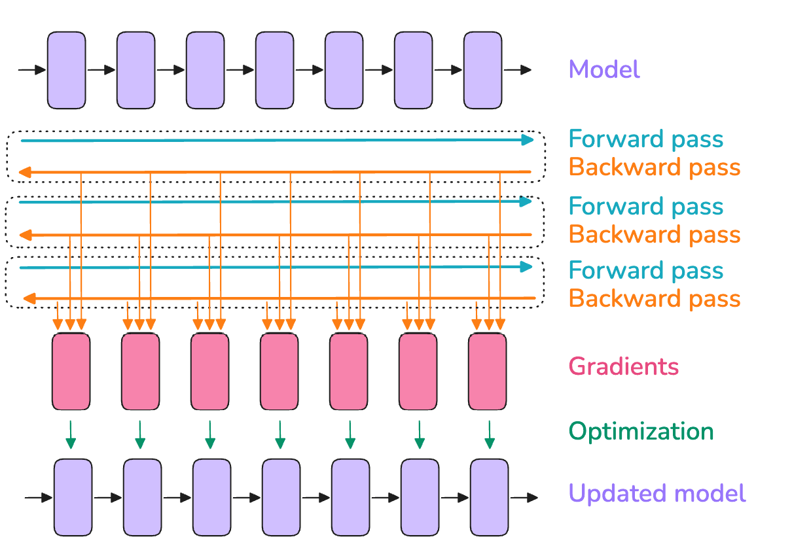
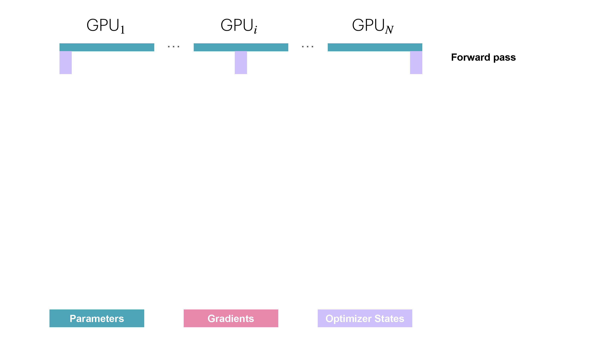
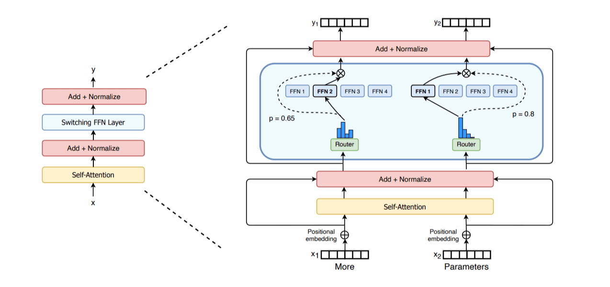
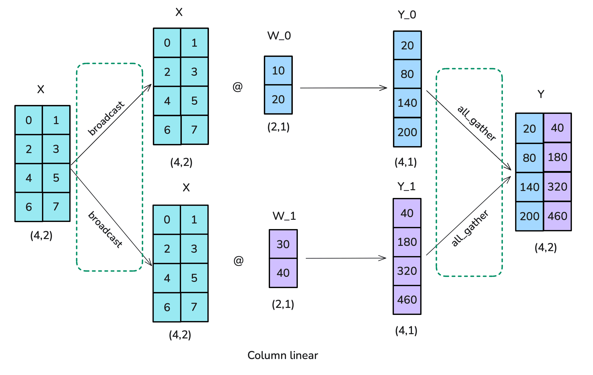
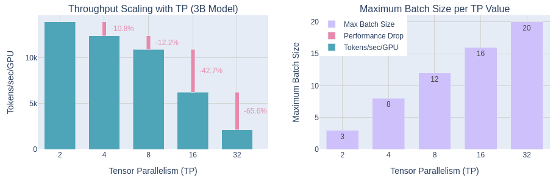
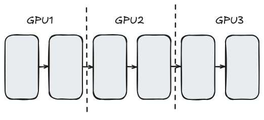
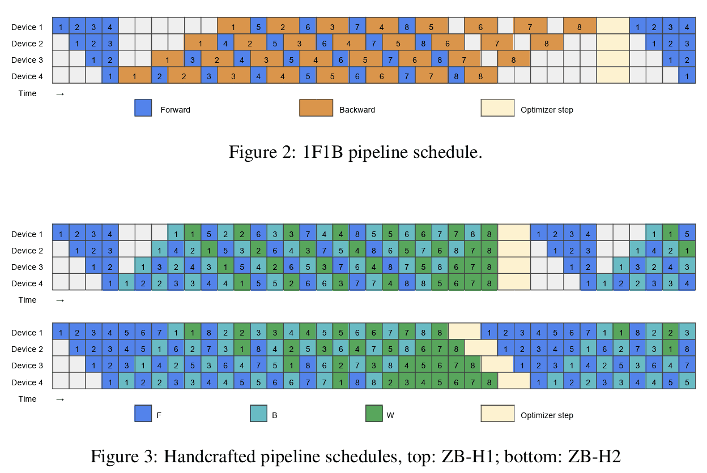

<section data-visibility="hidden" markdown=1>

This section is available as slides which is presented on the workshop. This
text version include some additional notes. You can also access the slide
version [here](../parallelization_schemes-slides).

</section>

### Overview

<aside class="notes" markdown="1">

This session covers the following:

</aside>

- Parallelization schemes that are useful for LLM;
- Common tools that for running LLMs in parallel;


## Strategies

### Data parallelism (DP) {class="no-mkdocs"}
<style type="text/css" rel="stylesheet">
.reveal section {
  text-align: center;
}
</style>

{class="no-mkdocs"}


### Data parallelism (DP)
<style type="text/css" rel="stylesheet">
.reveal section {
  text-align: center;
}
</style>

<aside class="notes" markdown="1">

The trivial way to parallelize a LLM is to run multiple replicas of the model,
and process different data. As the data are not related to one another, it is
almost trivial to implement. One would only need to synchronize the weights
when training the model.

Downside of this approach is that the model needs to be replicated and thus
needs to fit on one GPU; the synchronization of weights also incurs some
overhead, albeit less significant than other model parallelism schemes.

</aside>


{ style="height:360px;" }  
Image source: [ultrascale playbook]


<div markdown="1" class="no-mkdocs">

- Trivial to implement;
- Syncing overhead for training;
- Memory cost due to replication.

</div>

### Overlapping in DP

<aside class="notes" markdown="1">

To mitigate the communication overhead, one can use the so-called overlapping
technique, that is, synchronize the weights during the back-propagation process.

</aside>

{ style="height:180px;" }
{ style="height:180px;" }  
Image source: [ultrascale playbook]

<div markdown="1" class="no-mkdocs">

- Overlapping reduces communication overhead.

</div>

### Sharding in DP

<aside class="notes" markdown="1">

While data-parallelism is nice, the biggest limitation is that we can not use it
for large models that does not fit in one GPU. To fit larger models to one GPU,
we can store part of the variables in each GPU, and access it only while necessary.

This is known as the
[ZeRO](https://deepspeed.readthedocs.io/en/latest/zero3.html) optimization, of
the deepspeed library. With three stages of optimization, the optimizer state,
the gradients and the weights.  The fully sharded data parallel (FSDP2)
resembles ZeRO stage 3 optimization.

Note that sharding of data is not free lunch, transfer of sharded states do
incur extra cost due to both communication overhead and extra memory needed to
store the metadata. Typically optimizer state is the most expensive part in
training tasks so ZeRO-1 brings the most improvement.

Going for more sharding does not always improve the performance, as a rule of
thumb, ZeRO-2 is often consider balance. Note that when fine-tuning the model,
there will be much less gradients and optimizer states to store, sharding in
this case might not be really desirable.

Closely related to sharding is the offloading of memories to RAM or other fast
storage, this goes out of the scope of this session but you can find some
examples
[here](https://www.c3se.chalmers.se/documentation/software/machine_learning/deepspeed/?h=torchrun#other-options).

</aside>

{ style="height:360px;" }  
Image source: [ultrascale playbook]

<div markdown="1" class="no-mkdocs">

- Sharding reduces memory usage;
- Three levels of sharding (optimizer, gradients,weights);
- ZeRO-methods / FSDP2.

</div>

### Expert (MoE) parallelism

<aside class="notes" markdown="1">

In a similar spirit of sharding in data parallelism, one can implement models
for which only part of a model is active for a given data input. This way, the
parts of the model (so-called experts) can be naturally put on different GPUs
and no inter-GPU would be necessary.

</aside>


{ style="width:600px" }  
Image source: [ultrascale playbook]

<div markdown="1" class="no-mkdocs">

- Activate only subsets of experts per token;
- Similar to sharding, but reduce need for data exchange.

</div>

### Tensor parallelism {class="no-mkdocs"}
<style type="text/css" rel="stylesheet">
.reveal section {
  text-align: center;
}
</style>

{class="no-mkdocs"}


### Tensor parallelism
<style type="text/css" rel="stylesheet">
.reveal section {
  text-align: center;
}
</style>

<aside class="notes" markdown="1">

Tensor parallelism (TP) splits a model by distributing individual tensor
operations (matrix multiplications) to different GPUs. Unlike data parallelism,
the same data will be processed by different GPUs and the results gathered (or
summed). Depending on which direction the computation is sliced, it can be
further categorized into row- or column versions.

Notably, tensor parallelism needs some careful design, by labeling how
each layer will be parallelized. Taking the below illustration of row- and
column- version, one see that if one perform a column-split followed by a
row-split, one can omit the intermediate `all_gather` step since each GPU will
only take one column as the next input.

TP for inference tasks is somewhat well supported (e.g. in
[vLLM](https://docs.vllm.ai/en/latest/serving/parallelism_scaling/#distributed-inference-strategies-for-a-single-model-replica)
and
[deepspeed](https://www.deepspeed.ai/tutorials/automatic-tensor-parallelism/). Tensor
parallel support is less readily available. Know (untested) implements are that
of
[Megatron-LM](https://docs.nvidia.com/megatron-core/developer-guide/latest/user-guide/index.html#quick-start)
and [NeMo](https://docs.nvidia.com/nemo-framework/user-guide/latest/nemotoolkit/features/parallelisms.html)

</aside>

{ .fragment .current-visible style="height:360px;" }
{ .fragment .current-visible style="height:360px;" }  
Image source: [ultrascale playbook]

<div markdown="1" class="no-mkdocs">

- row vs. column version;
- needs to be carefully designed;

</div>


### Tensor parallelism (cont.)

<aside class="notes" markdown="1">

One shall also note that TP requires more intermediate results to be synced and
much more synchronization operations than DP. It is thus essential that TP is
done where GPUs have fast and low-latency access memory to each other.

This usually means TP is only efficient when done within one compute node in the
cluster, below is the benchmarks given in the ultrascale playbook, with 8-GPU
nodes. We see a noticeable decrease in performance going from 8 to 16 GPUs.

</aside>

{ style="height:360px;" }  
Image source: [ultrascale playbook]

<div markdown="1" class="no-mkdocs">

- expensive communication;
- efficiency reduce with inter-node parallelization;

</div>

### Pipeline parallelism (PP) {class="no-mkdocs"}
<style type="text/css" rel="stylesheet">
.reveal section {
  text-align: center;
}
</style>

{class="no-mkdocs"}


### Pipeline parallelism (PP)

<aside class="notes" markdown="1">

One can also split the model "sequentially", such that each GPU process only a
"segment" of the model and hence the name "pipeline parallelism". Unlike TP,
pipeline parallelism (PP) only require minimal inter-GPU communication, so it is
ideal for parallelization across multiple nodes.

However, with naive PP only one GPU will be working a time; this is easy to
solve for inference tasks, if one have multiple inputs to be processed (think
about setting up a server that serves a LLM, different users' requests can be
queued and the GPU will always be busy for some request.

For training tasks, this is more tricky as next forward pass necessarily depends
on the previous backward pass. Nevertheless, it is beneficial to have smaller
mini-batches per parameter update, so that the "bubble" of idling GPUs is less
significant.

</aside>


{ style="width:800px" }
{ style="width:800px" }  
Image source: [ultrascale playbook]

<div markdown="1" class="no-mkdocs">

- Training: bubbling problem;
- Can be mitigated by smaller batch size (and accumulating the gradients);

</div>

### Pipeline parallelism (cont.)

<aside class="notes" markdown="1">

More sophisticated schedule is possible to further reduce the bubble further, or
reduce the overhead in between the steps. Though implement is not generally
available.

</aside>

{ style="width:600px" }  
Image source: [ultrascale playbook]

<div markdown="1" class="no-mkdocs">

- More strategies exist;
- Balancing, bubble, memory and communication;
- Implement is not trivial.

</div>


### Hybrid / 3D parallelism


<aside class="notes" markdown="1">

Finally, we shall note that for really huge models that fits only on many nodes,
one need to combine multiple model parallelization schemes for optimal
performance. Typically one perform TP on one node, and arrange computes nodes
with DP and PP.

</aside>


{ style="width:600px" }  
Image source: [ultrascale playbook]

- For really large models one need to combine the techniques;

## Implementations

### Distributed computing - MPI

<aside class="notes" markdown="1">

MPI is a typical way of launching distributed computation tasks on a HPC
cluster. It integrates well with the cluster and works fine for data parallelism
tasks. Some early implementation in the DP scheme is implemented with MPI (but
it is less used in modern frameworks).

</aside>


```python
# just a simple script
...
hvd.init()
model = Model(...)
optimizer = hvd.DistributedOptimizer()
model.compile( ... )
model.fit( ... )
...

# and run in a job script
srun python train.py
```

<div markdown="1" class="no-mkdocs">

- General-purpose HPC communication;
- Integrates well with the cluster;
- Not so popular in AI/ML.

</div>

### Distributed computing - Ray

<aside class="notes" markdown="1">

A more popular framework is the ray framework. With ray one uses a python
interface to schedule tasks to different "remote" workers. This gives one
more flexibility to program how tasks will be distributed.

</aside>


```python
ray.init()

@ray.remote
def preprocess(data):
    ...

@ray.remote
def train(model_name, dataset):
	...

cleaned = [preprocess.remote(...) for data in dataset ]
trained_models = [train.remote(...) for data in cleand]

results = ray.get(trained_models)
```

<div markdown="1" class="no-mkdocs">

- Python-native distributed orchestration;

</div>


### Distributed computing - Ray (cont.)

<aside class="notes" markdown="1">

The "downside" is that ray needs to start its own service and communicate over
TCP ports that is not typical HPC jobs. Tasks needs to be "told" to act as
master and client nodes and the ray cluster needs to be started before actual
jobs are run. At Alvis we have some
[examples](https://www.c3se.chalmers.se/documentation/software/machine_learning/vllm/#example-python-client)
of running such jobs.

</aside>


```bash
# start ray head
srun -J "head ray node-step-%J" \
  apptainer exec ${SIF_IMAGE} ${RAY_CMD_HEAD} &
RAY_HEAD_PID=$!

# start ray worker
srun -J "worker ray node-step-%J" \
  apptainer exec ${SIF_IMAGE} ${RAY_CMD_WORKER} &
sleep 10

# start the actual script
apptainer exec ${SIF_IMAGE} vllm serve ${HF_MODEL} \
  --port ${API_PORT} ${vllm_opts}
```

<div markdown="1" class="no-mkdocs">
- Run in server/client mode;
- Needs more work to configure.
</div>


### Distributed computing - torchrun (Elastic Launch)

<aside class="notes" markdown="1">

A final example of starting distributed computing tasks is torchrun, is utilizes
the "Elastic Launch" protocol for jobs to join a training cluster. It is
designed to be fault tolerant (e.g.) allow worker to join/leave. It is less
tedious to set up as compared to a ray cluster and on Alvis we configure some
environment variables to easily start a distributed training job.

</aside>

```bash
export GPUS_PER_NODE=4
export MASTER_ADDR=${PROEPI_HEAD_NODE}
export MASTER_PORT=${PROEPI_FREE_PORT}

srun python -u -m torch.distributed.run \
	--nproc_per_node $GPUS_PER_NODE --nnodes $SLURM_NNODES --node_rank $SLURM_PROCID \
    --rdzv_id=$SLURM_JOB_ID --rdzv_backend=c10d --rdzv_endpoint=$MASTER_ADDR:$MASTER_PORT \
    $ARGS
```


### Popular training frameworks

- **PyTorch DDP**: standard (basic) DP in PyTorch;
- **PyTorch FSDP**: improved with sharding;
- **DeepSpeed**: implements advanced schemes (most sharding);
- **Megatron-LM**: Nvidia's implementation (tensor-parallelism);
- **Other options**: NeMo, Colossal-AI, FairScale, ...

### Popular inference frameworks

- **vLLM**: PagedAttention and dynamic batching;
- **DeepSpeed**: fused attention;
- **Triton**: NVIDIA’s inference platform;

## Summary

### Take home-message

- Enough memory: use data parallelism;
- On a single node: prefer tensor parallelism;
- On many nodes: user pipeline parallelism;
- For training: the [ultrascale playbook];
- For inference: use a inference engine.

[ultrascale playbook]: https://huggingface.co/spaces/nanotron/ultrascale-playbook?section=high-level_overview

