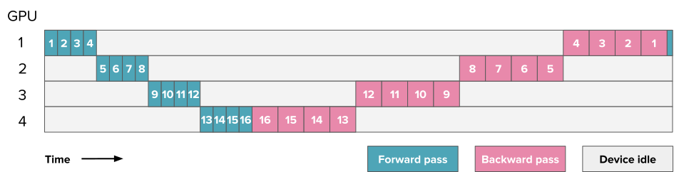
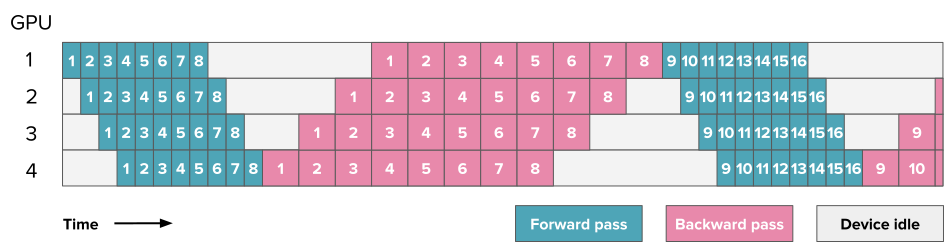

### Motivation

- Parallelization is necessary;
- Good vs. bad parallelization.

## Strategies

### Data parallelism (DP)

{ style="height:360px;" }

- Trivial to implement;
- Syncing overhead for training;
- Memory cost due to replication.


### Overlapping in DP

{ style="height:180px;" }
{ style="height:180px;" }

- Overlapping reduces communication overhead.

### Sharding in DP

{ style="height:360px;" }

- Sharding reduces memory usage.

### Tensor parallelism

{ .fragment .current-visible style="height:360px;" }
{ .fragment .current-visible style="height:360px;" }

- Row vs. column version;
- Expensive communication.


### Tensor parallelism (cont.)

{ style="height:360px;" }

- Tensor parallelism reduces memory usage;
- Efficiency reduce with inter-node parallelization;

### Pipeline parallelism

{ style="width:800px" }
{ style="width:800px" }

- Training: bubbling problem;
- Combine with DP to for better performance;

### Pipeline parallelism (cont.)

{ style="width:600px" }

- More strategies exist;
- Balancing, bubble, memory and communication;
- Implement is not trivial.

### Expert (MoE) parallelism

{ style="width:600px" }

- Activate only subsets of experts per token;
- Reduces compute cost for huge models.

### Hybrid / 3D parallelism

{ style="width:600px" }

- For really large models one need to combine the technique;

## Implementations

### Distributed computing - MPI

```python
# just a simple script
...
hvd.init()
model = Model(...)
optimizer = hvd.DistributedOptimizer()
model.compile( ... )
model.fit( ... )
...

# and run in a job script
srun python train.py
```

- General-purpose HPC communication;
- Integrates well with the cluster;
- Not so popular in AI/ML.
  
### Distributed computing - Ray

```python
ray.init()

@ray.remote
def preprocess(data):
    ...

@ray.remote
def train(model_name, dataset):
	...

cleaned = [preprocess.remote(...) for data in dataset ]
trained_models = [train.remote(...) for data in cleand]

results = ray.get(trained_models)
```
  
- Python-native distributed orchestration;


### Distributed computing - Ray (cont.)

```bash
# start ray head
srun -J "head ray node-step-%J" \
  apptainer exec ${SIF_IMAGE} ${RAY_CMD_HEAD} &
RAY_HEAD_PID=$!

# start ray worker
srun -J "worker ray node-step-%J" \
  apptainer exec ${SIF_IMAGE} ${RAY_CMD_WORKER} &
sleep 10

# start the actual script
apptainer exec ${SIF_IMAGE} vllm serve ${HF_MODEL} \
  --port ${API_PORT} ${vllm_opts}
```

- Run in server/client mode;
- Needs more work to configure.

### Popular training frameworks

- **PyTorch DDP**: standard (basic) DP in PyTorch;
- **PyTorch FSDP**: improved with sharding;
- **DeepSpeed**: implements advanced schemes;
- **Megatron-LM**: Nvidia's  of 3D parallelism; 
- **Other options**: Colossal-AI, FairScale, ...

### Popular inference frameworks

- **vLLM**: PagedAttention and dynamic batching;
- **DeepSpeed**: fused attention;
- **Triton**: NVIDIA’s inference platform;
- **Other frameworks**: ???

## Summary

### Take home-message

- Enough memory: use data parallelism;
- On a single node: prefer tensor parallelism;
- On many nodes: user pipeline parallelism;
- For training: [Ultrascale playbook](https://huggingface.co/spaces/nanotron/ultrascale-playbook?section=high-level_overview).
- For inference: use a inference engine.


