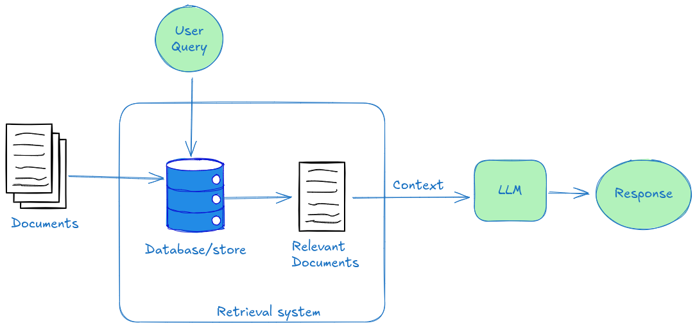
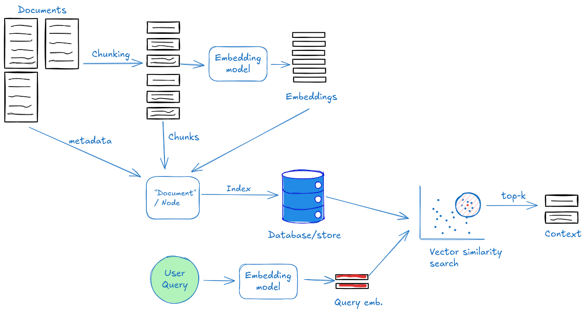
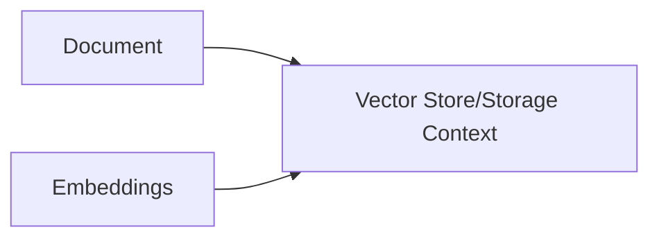
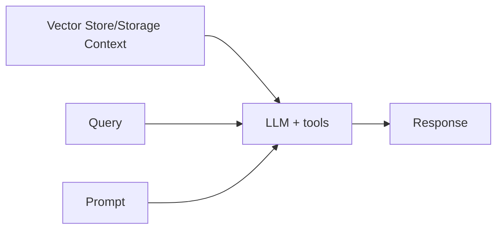
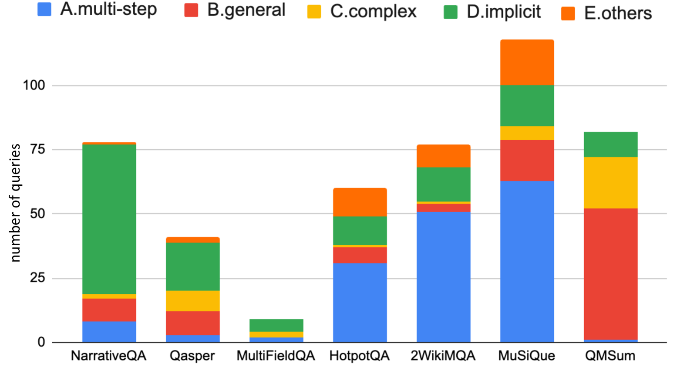

---
tags:
  - rag
  - retrieval augmented generation
icon: material/database-search
---

# Retrieval Augmented Generation (RAG)

???- info "Learning outcomes"

    - Understand the key components of RAG applications by looking at what popular open-source RAG libraries provide
    - Perform an Agentic RAG task 

{ align=right width=300 }

* LLMs are not trained on your personal data or fairly recent data.

* RAG can help provide richer and accurate responses based on external knowledge.

* It incurs significantly lower computation cost compared to long-context LLMs.

* We will learn RAG through the lens of popular open-source RAG libraries, viz. [LangChain](https://www.langchain.com/langchain) and [LlamaIndex](https://www.llamaindex.ai/llamaindex). 

## Basics

???- note "RAG figures"
    
    ???- note "Naive RAG"
        
        

    ???- note "Naive Retrieval System"
        

## Stages in RAG 🔄

!!!- note inline end "Atomic unit"

    - LangChain's atomic unit is a Document.
    - LlamaIndex's atomic unit is a Node. A collection of Nodes consitutes a Document.

### Loading 📥

Loading/Parsing data from source and creating well-formatted _Documents_ with metadata. (1)  
This step includes splitting texts such that it can be embedded into lower dimensions.

  

!!!- note inline end "Document parsing sequence"

    - LangChain creates Documents first and then performs chunking.
    - LlamaIndex performs chunking first, that becomes a Node and then creates Documents of multiple Nodes.

### Indexing 📊

Creating data structure and/or reducing dimensions of the data for easy querying of data.(2)

### Storing 💾

 Storing _Documents_, metadata and embeddings in a persistant manner (Ex. Vector Stores). (3)

### Querying ❓

Retrieving relavent _Documents_ for a user _Query_ and feeding it to LLM for added context. (4)

### Evaluation 📈

Trace inspection, meterics, comparisons to test if full pipeline gives desired results. (5)

1. LlamaIndex ex.: [SimpleDirectoryReader class](https://developers.llamaindex.ai/python/framework/module_guides/loading/simpledirectoryreader)  
LangChain ex.: [document_loaders module](https://docs.langchain.com/oss/python/integrations/document_loaders), [langchain_text_splitters module](https://docs.langchain.com/oss/python/integrations/splitters)

2. LlamaIndex ex.: [VectorStoreIndex class](https://developers.llamaindex.ai/python/framework/module_guides/indexing/vector_store_index)  
LangChain ex.: [Embeddings class](https://reference.langchain.com/python/langchain_core/embeddings/?_gl=1*vnaur7*_gcl_au*NDUyNDc5MjE5LjE3NjE1Nzk0NTI.*_ga*NjQzNjgwODkuMTc2MTgzNDY5NA..*_ga_47WX3HKKY2*czE3NjE4MzQ2OTQkbzEkZzEkdDE3NjE4MzYzODIkajEzJGwwJGgw)

3. LlamaIndex ex.: StorageContext  
LangChain ex.: VectorStore

4. LlamaIndex ex.: RetrieverQueryEngine class  
LangChain ex.: Retriever class  

5. LlamaIndex ex.: LLM-Evaluator  
LangChain ex.: LangSmith, QAEvalChain

* Retrieval techniques
* QA/chat
* Misc: Reranker model, GraphRAG, RAPTOR, EraRAG, multimodal

!!!- example "Exercise"

    DIY: [vllm with langchain](https://docs.vllm.ai/en/latest/examples/online_serving/retrieval_augmented_generation_with_langchain/)

!!!- note "When and when not to use RAG ⚖️"

    

    * It was found[^1] that RAG lags behing Long-Context LLMs in the following scenarios: (1)
        * Query requiring multi-step reasoning.
        * General queries to which embeddings model does not perform well.
        * Long and complex queries.
        * Implicit queries requiring the reader to connect the dots.

    * Way easier than just fine-tuning on personal data.
    * Allows smaller models with shorter context memory to be on par with larger models. Therefore, saving compute and memory cost on GPUs.

    
  
    
    1.   

???- note "Note on popular Chat UI frameworks"

    If doing basic RAG which can read a few of your documents and can search the web, check out popular LLM chat frameworks with integrated RAG functionality.

    - LMstudio
    - Open-webui
    - WebUI by llama.cpp
    - Chainlit

## Agentic RAG 🤖

* An LLM-powered agent **decides** when and how to retrieve during reasoning. This gives more flexibility in the decision making process by the system but low control over it by the engineer.
* Router
* Tool calling
* Multistep reasoning with tools
* [llm.txt](https://llmstxt.org/)
* Documentation sites have already started building their RAG powered chatbots: vllm, langchain, anthropic etc.

(More about Agents will be covered in Day 3.)

!!!- example "Exercise"

    - Copy `llm-workshop/containers/rag/rag_env.sh` to your `~/portal/jupyter/`
    - Start a jupyter server on A40 node using `rag_env.sh` runtime and working directory as your project folder.
    - Run `rag.ipynb`

!!!- note "Some more useful techniques in retrieval pipelines 🛠️"

    - [Rerankers](https://www.answer.ai/posts/2024-09-16-rerankers.html)
    - [GraphRAG](https://arxiv.org/pdf/2404.16130)
    - [RAPTOR](https://arxiv.org/pdf/2401.18059)
    - [EraRAG](https://arxiv.org/abs/2506.20963)

Have you tried out chatbot for UPPMAX docs yet? Its a RAG system under the hood! C3SE chatbot is coming soon too.

???- info "Resources 📚"

    - Recommended papers on RAG:

        - [Retrieval-Augmented Generation for Knowledge-Intensive NLP Tasks](https://arxiv.org/abs/2005.11401)
        - [REALM: Retrieval-Augmented Language Model Pre-Training](https://arxiv.org/pdf/2002.08909)
        - [Dense Passage Retrieval for Open-Domain Question Answering](https://aclanthology.org/2020.emnlp-main.550)
        - [Improving language models by retrieving from trillions of tokens](https://arxiv.org/abs/2112.04426)

    - Popular libraries and software suite:
        - [llama_index](https://github.com/run-llama/llama_index)
        - [LangChain](https://github.com/langchain-ai/langchain)
        - [RAGFlow](https://github.com/infiniflow/ragflow)

[^1]: Retrieval Augmented Generation or Long-Context LLMs? A Comprehensive Study and Hybrid Approach [arXiv](https://arxiv.org/html/2407.16833v1)
