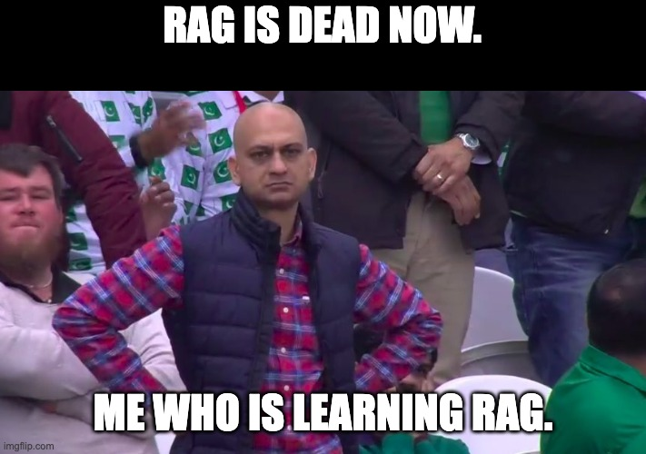

---
tags:
  - rag
  - retrieval augmented generation
icon: material/database-search
---

# RAG

???- info "Learning outcomes"

    - Understand the key components of RAG applications
    - Perform a simple RAG task 

{ align=right width=300 }

* LLMs are not trained on your personal data or fairly recent data.

* Retrieval-Augmented Generation can help provide richer and accurate responses based on external knowledge.

* It incurs significantly lower computation cost compared to long-context LLMs.

## Stages in RAG

* **Loading**: Loading/Parsing data from source and creating well-formatted _Documents_ with metadata. (1)

* **Indexing**: Creating data structure for easy querying of data. Create embeddings. (2)

* **Storing**: Storing _Documents_, metadata and embeddings in a persistant manner (Ex. Vector Stores). (3)

* **Querying**: Retrieving relavent _Documents_ for a user _Query_ and feeding it to LLM for added context. (4)

* **Evaluation**: Trace inspection, meterics, comparisons to test if full pipeline gives desired results. (5)

1. LlamaIndex ex.: BaseReader class  
LangChain ex.: DocumentLoader class

2. LlamaIndex ex.: VectorStoreIndex class  
LangChain ex.: 

3. LlamaIndex ex.: StorageContext  
LangChain ex.: VectorStore

4. LlamaIndex ex.: RetrieverQueryEngine class  
LangChain ex.: Retriever class  

5. LlamaIndex ex.: LLM-Evaluator  
LangChain ex.: LangSmith, QAEvalChain

* Document loading/parsing: also includes metadata
* Document spliting
* Embedding models: embeddings for both query and docs.
* Vector stores
* Retrieval techniques
* QA/chat
* Misc: Reranker model, GraphRAG, RAPTOR, EraRAG, multimodal

https://learn.deeplearning.ai/courses/langchain-chat-with-your-data/lesson/snupv/introduction

???- info "Resources"

    - Recommended papers on RAG:

        - [Retrieval-Augmented Generation for Knowledge-Intensive NLP Tasks](https://arxiv.org/abs/2005.11401)
        - [REALM: Retrieval-Augmented Language Model Pre-Training](https://arxiv.org/pdf/2002.08909)
        - [Dense Passage Retrieval for Open-Domain Question Answering](https://aclanthology.org/2020.emnlp-main.550)
        - [Improving language models by retrieving from trillions of tokens](https://arxiv.org/abs/2112.04426)

    - Popular libraries and software suite:
        - [llama_index](https://github.com/run-llama/llama_index)
        - [LangChain](https://github.com/langchain-ai/langchain)
        - [RAGFlow](https://github.com/infiniflow/ragflow)

!!!- info "When and when not to use RAG"

    

    * It was found[^1] that RAG lags behing Long-Context LLMs in the following scenarios: (1)
        * Query requiring multi-step reasoning.
        * General queries to which embeddings model does not perform well.
        * Long and complex queries.
        * Implicit queries requiring the reader to connect the dots.

    * Way easier than just fine-tuning on personal data.
    * Allows smaller models with shorter context memory to be on par with larger models. Therefore, saving compute and memory cost on GPUs.  

    
  
    
    1.   

## Agentic RAG

* Router
* Tool calling
* Multistep reasoning with tools

(More about Agents will be covered in Day 3.)

https://learn.deeplearning.ai/courses/building-agentic-rag-with-llamaindex/lesson/yd6nd/introduction

[^1]: Retrieval Augmented Generation or Long-Context LLMs? A Comprehensive Study and Hybrid Approach [arXiv](https://arxiv.org/html/2407.16833v1)
